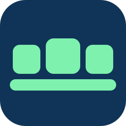
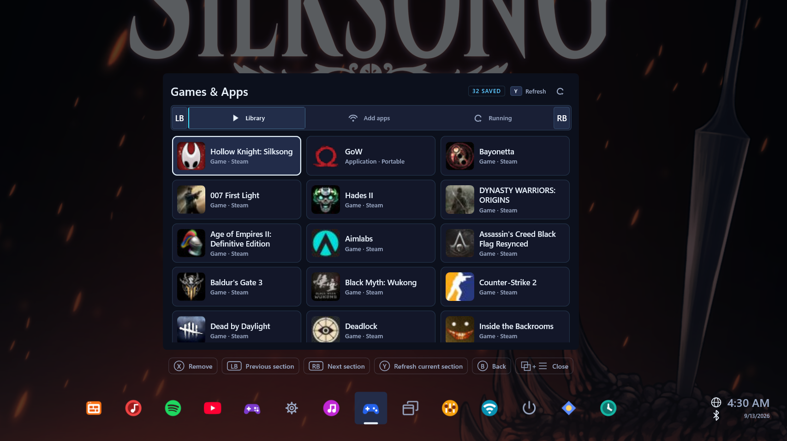
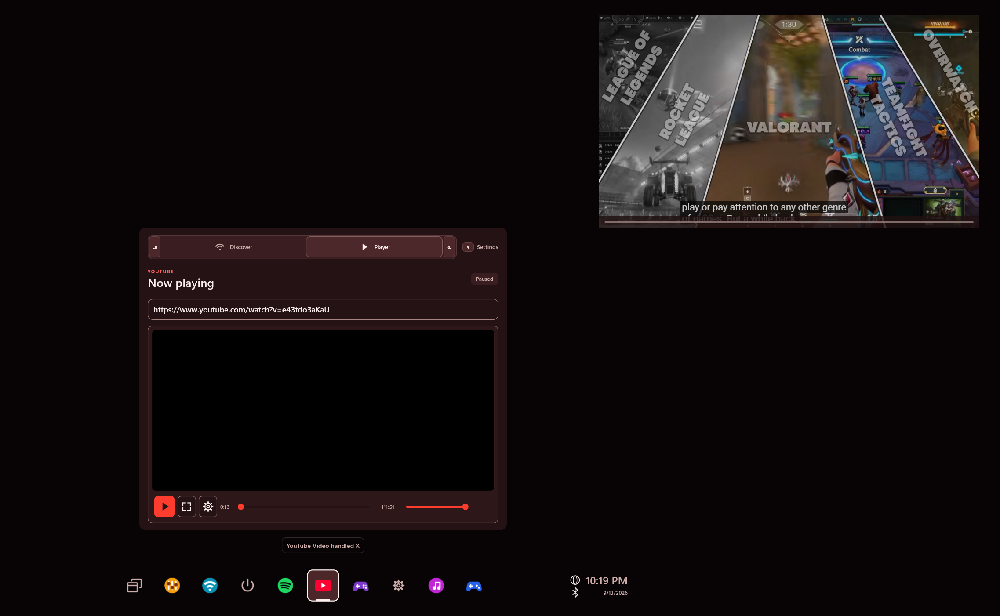
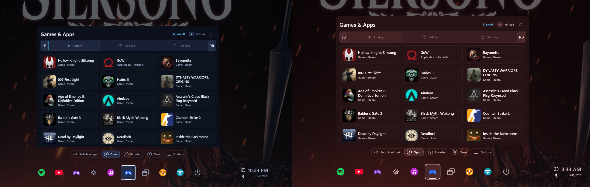

# WidgetRail

**A controller-first Windows overlay and open-source C# widget framework.**

WidgetRail brings audio, media, applications, connectivity, and display controls
into one interface. Use it with a controller, keyboard, or mouse, and keep supported
video or compact widget views visible while the main overlay is closed.

[Download](https://github.com/sandwi-dev/WidgetRail/releases) · [Installation](docs/users/getting-started.md) · [Documentation](docs/README.md) · [Build a widget](docs/developers/widget-quickstart.md)

## Controller navigation

Navigate buttons, sliders, menus, lists, and game libraries with the D-pad or
left stick. The right stick scrolls content, and a contextual guide shows the
actions available for the current selection. Text fields support an on-screen
controller keyboard.

- **Controller support:** Xbox-compatible controllers and native DualSense input over USB or Bluetooth. Controller hints use Xbox or PlayStation glyphs according to the detected input.
- **Opening shortcut:** choose **View + Menu** or **Guide** in Settings. Guide supports both the Xbox Guide button and the PlayStation PS button.
- **Keyboard and mouse:** use pointer controls, or navigate with arrows, Enter, and Escape. **F1** shows or hides the overlay.
- **Optional Exclusive control:** keep a supported controller's input in WidgetRail while the overlay is open. This requires HidHide and ViGEmBus; review the [compatibility notes](docs/users/known-limitations.md#games-and-controller-input) before enabling it.

### Widget switching

Choose **Radial + rail** or **Rail** in **Settings → Overlay → Widget switcher**.

**Radial + rail** provides direct selection from a wheel, with eight widgets per
page. Press B at a widget's top level to open it, point the left stick to preview
a widget, and press A to enter. The right stick changes pages without changing
the current preview until another icon is selected.

The horizontal rail remains available by moving down past the widget's bottom
row. Browse left or right to preview widgets and use their available dashboard
shortcuts. The tray menu also provides pinning, reordering, and reload controls.

[Controller and keyboard reference](docs/users/controls.md)

## Pinned video and compact widgets

Pin a supported view, then close the main overlay. Video playback or a compact
widget remains visible over the desktop or a compatible game. Pin controls
let you move, resize, or remove it using the controller.

Widgets can provide layouts for different tasks. YouTube offers pinned video;
Spotify offers compact playback controls and a larger now-playing view with
upcoming tracks. Press View to switch controller focus between a pinned view
and the main overlay.

Pinned layouts are provided by each widget; not every view is pinnable.
Windowed and borderless games provide the most reliable experience.
[Pinning guide](docs/users/pinning.md) · [Display-mode compatibility](docs/users/known-limitations.md)

## Built-in widgets

Both installer editions include the following widgets:

| Widget | Features |
|---|---|
| **Audio Mixer** | Control master and per-app volume, select output and microphone devices, and choose supported spatial sound formats. |
| **Games & Apps** | Browse and launch Windows applications and discovered games. |
| **Task Switcher** | View live window previews, switch applications, and request that a window close. |
| **Now Playing** | View and control media sessions reported by Windows. |
| **Network Controls** | Toggle Wi-Fi and Bluetooth radios and view connection details. Connect or disconnect Wi-Fi, manage saved networks and automatic connection, and scan, pair, or remove Bluetooth devices. |
| **Display Profiles** | Save the current monitor setup and restore it later. Confirm with Keep changes or let the previous setup restore automatically. |
| **Power** | Sleep, restart, or shut down Windows. Restart and shutdown require confirmation. |
| **Settings** | Configure layout, appearance, accessibility, controllers, startup, widgets, permissions, and diagnostics. |

The tray displays local time, internet connectivity over Wi-Fi or Ethernet,
and Bluetooth radio status. Available controls depend on Windows permissions,
connected hardware, and installed providers.

## Additional widgets

These add-ons are available as separate `.wrwidget` downloads. They are not
included in either installer.

| Add-on | Features | Setup requirements |
|---|---|---|
| [Spotify](samples/SpotifyWidget/README.md) | Search tracks, albums, artists, and playlists; browse playlists and the queue; add individual tracks to the queue; choose a playback device or use **Play here**; pin playback controls. | Spotify account, a developer app, and Premium for streaming and playback control. |
| [YouTube Video](samples/YouTubeWidget/README.md) | Search public videos, play a link, seek, adjust volume and playback speed, loop, and use pinned or fullscreen playback. | A Google API key for search. Playing a public link does not require a search key. |
| [Playnite Library](samples/PlayniteLibraryWidget/README.md) | Browse and search games, filter the library, launch installed games, and manage favorites, categories, hidden games, and completion status. | Playnite running with a compatible Playnite Bridge and a configured connection token. |

Each widget's README covers installation, screenshots, and service-specific
requirements.

## Customization

Settings separates overlay layout, appearance, accessibility, and controller
behavior. Interface size and text size are remembered independently for each
display; they do not change Windows display scaling.

| Option | Available settings |
|---|---|
| **Overlay position** | Center, Bottom left, or Bottom right. Corner layouts keep the outside and bottom edges fixed during widget resizing, with guide hints aligned to the chosen side. |
| **Widget switcher** | Radial + rail or the horizontal rail. |
| **Interface size** | 50%–125%, saved per display. |
| **Text size** | 85%–150%, saved per display. |
| **Themes** | Built-in themes and installable theme packages. Shared controls and controller hints follow the selected theme. |
| **Animations** | Enable or disable widget-switch animations, follow Windows motion preferences, or select Reduced motion. |
| **Contrast and readability** | Follow Windows high contrast, enable High contrast, use Bold text, or reduce transparency. |
| **Backdrop** | Adjust backdrop opacity from 0% to 80%. |
| **Startup** | Start WidgetRail quietly when signing in to Windows. |
| **Tray organization** | Reorder widgets, enable or disable them, and reload a widget from its tray controls. |

New installations use **Neon Circuit**, **Radial + rail**, centered placement,
bold text, and widget-switch animations. Startup is off by default.

[Customization guide](docs/users/customization.md) · [Theme packages](docs/developers/theme-packaging.md)

## Widget installation and management

Use **Settings → Widgets** to install a local `.wrwidget` package, review
permissions, and enable it. Full-access widgets require explicit approval because
they run with your Windows account's permissions.

The same section supports manual updates, uninstalling add-ons, and removing
unused older versions. Built-in widgets update with WidgetRail. Add-ons update
separately, and updates require review before they are enabled.

The included `wrail` CLI can also install widgets and themes from local packages
or named GitHub release assets with checksum verification.
[Package installation](docs/developers/publishing-and-installation.md)

## Performance

Standard widget interfaces use native rendering. Browser-based surfaces are
used separately for supported embedded web media.

- **Rendering reuse:** unchanged styles, text layouts, and prepared content are cached. Updates repaint affected areas where possible.
- **Paged content and artwork:** long collections load as needed. Images are decoded for their display size, with bounded memory caches and a disk cache for eligible web artwork.
- **Lifecycle management:** widgets can reduce background work or unload while hidden. Audio Mixer unloads after two minutes hidden; Playnite Library unloads after five. Pinned widgets stay active, and media widgets can remain loaded to preserve playback.

Memory use varies with display size, artwork, active widgets, and playback.

[Widget lifecycle](docs/reference/widget-residency.md) · [Artwork caching](docs/reference/artwork-disk-cache.md)

## Widget development

WidgetRail provides a **C# SDK** for declarative interfaces and action handling.
The host manages native rendering, responsive layout, controller navigation,
scrolling, and shared styling.

| Framework capability | Included support |
|---|---|
| **UI components** | Buttons, sliders, selectors, menus, text entry, posters, and responsive collections. |
| **Presentation composition** | Navigation shells, command bars, and reusable layout helpers for multi-section widgets. |
| **Navigation and actions** | Focus management, nested navigation, shortcuts, and contextual controller hints. |
| **Data and lifecycle** | Paged collections, loading and error states, and policies for background work and idle unloading. |
| **Styling** | WRSS styles, shared themes, and accessibility overrides. |
| **Media** | Supported embedded media, live window previews, and widget-defined pinned layouts. |
| **Windows integration** | Permission-scoped platform services and support for local companion applications. |

The `wrail` CLI includes project templates, validation, development previews,
rebuilding on source changes, scenario previews, and package creation.
The native inspector shows layout, resolved styles, focus, and diagnostic
information while a development widget runs.

Both installer editions include the CLI and templates. The Developer edition
adds SDK Gallery and reference widgets. Writing an ordinary C# widget does not
require building the native host.

[Widget quickstart](docs/developers/widget-quickstart.md) · [Core concepts](docs/developers/concepts.md) · [Presentation composition](docs/reference/presentation-composition.md) · [CLI and inspector](docs/reference/cli-workflows.md) · [Authoring guide](docs/developers/widget-authoring-guide.md)

## Download and installation

WidgetRail is preview software for **Windows 10 build 19041 or newer and
Windows 11, x64**.

| Edition | Contents |
|---|---|
| **Production** | The overlay, built-in utility widgets, CLI, and widget templates. |
| **Developer** | Everything in Production, plus SDK Gallery and reference samples. |

These are two editions of the same application version, not separate stable
and unstable channels. This README describes the current source version;
release notes identify the changes included in each downloadable preview.

Download the installer from [GitHub Releases](https://github.com/sandwi-dev/WidgetRail/releases).
It includes private .NET base and Windows Desktop runtimes, and checks for
GameInput and WebView2. A missing WebView2 runtime requires an internet download.

Application updates are manual: quit WidgetRail and run the newer installer.
Your settings and installed add-ons are retained.

[Installation and updates](docs/users/getting-started.md) · [Build from source](docs/maintainers/building.md)

## Recommended setup

- Turn on **Automatically hide the taskbar** for more space around the overlay.
- Turn off **Xbox full-screen experience / Xbox mode**, if available, to use WidgetRail with the normal Windows desktop.
- Turn off **Allow your controller to open Game Bar** in **Windows Settings → Gaming → Game Bar**.
- If Windows offers **Use View + Menu as Guide button in apps**, turn it off. Otherwise, Windows can report that combination as Guide.
- In **WidgetRail Settings → Controllers**, set **Controller shortcut** to **Guide** to reduce conflicts with games that use View and Menu. Xbox Guide and PlayStation PS buttons are supported.
- Use **borderless windowed** mode for the most reliable overlay and pinned-video experience.

These settings are optional. WidgetRail does not change them automatically.
[Windows setup details](docs/users/getting-started.md#recommended-windows-settings)

## FAQ

### What if widgets are too large or too small, or the guide, tray, and widget overlap?

Adjust **Settings → Overlay → Interface size** between 50% and 125%.
Use **Settings → Accessibility → Text size** for a separate text adjustment.
Both sizes are saved for the display shown in Settings. A new display uses
the existing default sizes; Windows display scaling is unchanged.

### Why does the overlay open but fail to take focus or switch apps?

Windows can refuse to give WidgetRail foreground focus, including over some
system windows such as Task Manager and Settings. The overlay may stay visible
while input reaches the other app, and Task Switcher may be unable to activate
a window. This does not always mean the other app is running as administrator.

If the guide says **Focus blocked**, try clicking inside the overlay. If that
does not help, use Alt+Tab to switch to the desktop or a regular app, then reopen
WidgetRail. [Foreground troubleshooting](docs/users/troubleshooting.md#the-overlay-cannot-take-foreground-focus)

### How do I install Playnite Library or another full-access widget?

Download its `.wrwidget` file and choose **Settings → Widgets → Install local
widget**. Review the full-access confirmation, then configure and enable the
widget. Playnite also requires its [companion setup](samples/PlayniteLibraryWidget/README.md).

### Why is an enabled widget missing from the tray?

A **Built in** copy takes priority over an installed duplicate, even when the
built-in copy is disabled. Use **Manage built-in version** to enable it.
Other widgets may need permission review or a compatible package.
[Widget management](docs/users/customization.md#manage-widgets)

### What if my controller shortcut does not open WidgetRail?

Confirm that WidgetRail is running and use the shortcut selected in
**Settings → Controllers**. For View + Menu, press both buttons together and
release them. Try **F1** on a keyboard to check whether the overlay opens.
Windows gaming features can also respond to Guide.
[Controller troubleshooting](docs/users/troubleshooting.md)

## License and contributions

The platform, SDK, first-party widgets, and templates are **MIT-licensed**.
You can reuse the examples and choose a license for your own widgets.
Third-party dependencies retain their respective licenses.

[Contributing](CONTRIBUTING.md) · [Issue tracker](https://github.com/sandwi-dev/WidgetRail/issues) · [Licensing](LICENSING.md)
