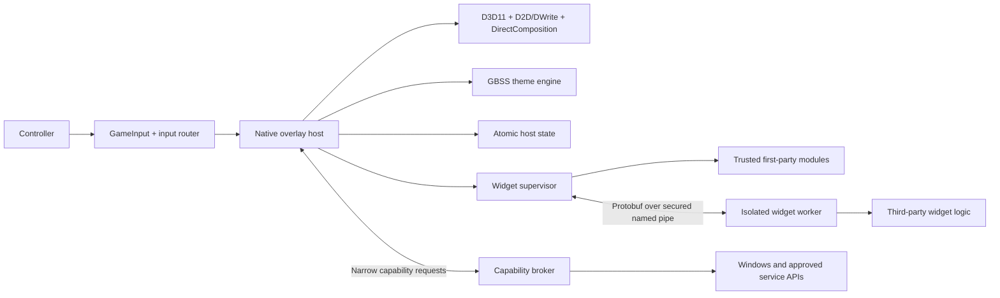

# Architecture and technology plan

Status: research baseline; Phase 0 now implements a narrower prototype subset,
2026-08-07

Current behavior is tracked in [implementation status](implementation-status.md)
and [platform architecture](platform-architecture.md). Proposed D3D11,
DirectComposition, and Protobuf components below are not claims about the
current Win32/Direct2D and JSON named-pipe prototype. The narrower mandatory
AppContainer worker and typed broker design has since been implemented; use the
current documents above rather than this research baseline for its contract.

## Recommendation

Use a small native resident shell and a host-rendered extension model:

The host owns pixels, controller routing, focus, animation, theming, accessibility, persistence, permissions, and lifecycle. Third-party logic contributes a semantic UI tree and reacts to events. This keeps the user experience consistent and allows a worker to crash or exit without taking the overlay with it.

## Why not copy Overwolf's runtime

Overwolf has strong ecosystem ideas: schema-validated manifests, declared permissions, development mode, packaging, discovery, signing, and lifecycle APIs. Its UI model is web-first, however, and its runtime uses browser processes. Microsoft documents that WebView2 similarly starts a browser process plus renderer, GPU, and helper processes. That is a poor default for an always-resident product whose defining promise is low overhead.

Web UI may become an explicitly opt-in advanced widget tier later. It should never be required for the shell or ordinary widgets.

## Existing projects and lessons

| Project | Useful precedent | What not to inherit |
| --- | --- | --- |
| PowerToys Command Palette | Standalone extension processes; manifest discovery; host-supplied list, form, grid, detail, and Markdown page primitives; Store/WinGet discovery | Its keyboard/query interaction model |
| Xbox Game Bar | Separate widget app identity; activation/IPC; Store distribution; compact controller UI | UWP-only SDK, shell-reserved controller behavior, rigid chrome, weak theme control |
| Overwolf | Excellent web developer funnel, manifest permissions, packaging, store, updates | Browser-heavy default, game targeting, centralized policy/monetization dependency |
| Playnite | Manifests, SDK templates, add-on browser, version compatibility, first-party integrations as samples | In-process community DLLs, dependency collisions, host-wide crash risk, restart requirement |
| Decky Loader | Controller-first quick menu, template repository, frontend/backend split | Injection into private Steam UI and broad plugin backend authority |
| Rainmeter | Deep declarative customization, variables, assets, lightweight update model | Arbitrary script/native plugins in the presentation process; GPL code copying |
| VS Code | Lazy extension activation, separate extension host, constrained contribution points, rare opt-in webviews | A permanently warm general-purpose extension runtime |
| Vigil Overlay | Direct Windows comparison, Guide support, safe mode, service boundaries, explicit input-containment warning | It is currently a one-commit project without an ecosystem; benchmark rather than depend on it |

The closest architectural match is PowerToys Command Palette: current Microsoft documentation describes each extension as a standalone .NET process communicating through a WinRT API while the host renders known page types. Our widget tree is richer and controller-oriented, but the isolation and host-rendered contribution model are directly applicable.

## Resident shell technology

### Proposed Phase 0 stack

- C++20 and Win32, initially unpackaged for rapid diagnostics
- Direct3D 11 device and a DXGI composition swap chain with premultiplied alpha
- Direct2D and DirectWrite for controls, text, icons, and vector drawing
- DirectComposition for visual transforms, opacity, and animations
- A borderless Per-Monitor-V2 panel plus non-activating monitor backdrop,
  topmost only while visible
- Current Microsoft GameInput runtime and `RegisterSystemButtonCallback`
- Event Tracing for Windows and PresentMon-based performance measurements

D3D11 is simpler than D3D12 for a predominantly 2D UI and interoperates directly with Windows Graphics Capture. DirectComposition is hardware accelerated and hands composition to DWM independently of the UI thread.

### UI framework decision

| Option | Strength | Cost | Decision |
| --- | --- | --- | --- |
| Native D2D/DWrite/DirectComposition | Lowest controllable resident footprint; exact overlay behavior | We must build layout, focus, controls, accessibility, and styling | Prototype first |
| WinUI 3 | Productive XAML, built-in focus/navigation, modern controls | Higher startup/RAM floor and less direct rendering lifecycle control | Build a small comparison if native control work dominates |
| WPF | Mature and productive | Older transparent-window and controller model | Do not start here |
| Avalonia/SDL/Skia | Portable, custom visual freedom | Portability has little value here; controller/accessibility remain custom | Do not start here |
| WebView2/Electron | Familiar web development and isolation tools | Multi-process browser baseline and resource variability | Reject for resident/default UI |

The widget protocol must not expose renderer-specific types. If the native approach proves too costly, the host renderer can change without redesigning every widget.

## Controller input

GameInput currently exposes Guide and Share through `RegisterSystemButtonCallback` and supports background Guide delivery. While the overlay is foreground, GameInput can request exclusive foreground input from other GameInput clients.

The prototype uses that callback as its primary Guide path. Testing found an
Xbox-360-class driver mode on an 8BitDo device that did not deliver Guide this
way, so the host also isolates a removable compatibility adapter around the
undocumented ordinal-100 extended-state export in system `xinput1_4.dll`. It
polls only for Guide and deduplicates rising edges with the GameInput source.
This is test evidence, not a supported Microsoft API or universal 8BitDo claim.

Internal routing is deterministic:

- Hidden: listen only for the Guide system-button callback.
- Dashboard: shell owns Guide, D-pad/analog navigation, A activation, and Y
  reorder; a selected card may expose bounded B/X/bumper/trigger/stick-click/
  Menu/View quick actions.
- Widget active: the shell owns D-pad/analog focus movement and A activation;
  the active widget scope owns the remaining non-Guide semantic buttons.
- Guide release is quarantined across a visibility transition to prevent double activation.
- Widgets never open GameInput or controller HID devices themselves.

Inside the current widget SDK, shortcut ownership is narrower than
widget-global: every snapshot explicitly publishes its active input scope. The
root is the default scope; nested component/window scopes can reuse bindings
without leaking into parents or siblings. Dashboard quick actions remain a
separate host surface, and Guide remains host-owned. Open-widget events echo
the active scope and rendered snapshot sequence; stale correlation is rejected.
The host, not the widget, remembers live focus per widget/scope.

There are two external limitations that require tests:

1. Xbox Game Bar, Steam, or another client may also react to Guide. A foreground game can also request exclusive Guide access. Onboarding may need users to disable conflicting shortcuts, and a controller-only fallback chord may be necessary for unsupported devices.
2. Focus is not universal controller suppression. Games using background Raw Input or their own HID access may still see `A`, `B`, bumpers, or sticks while the overlay is open. GameInput exclusivity does not promise to suppress every other input API.

There is no documented universal user-mode switch for the second problem. A filter/virtual-controller driver could enforce it but adds installation, security, latency, maintenance, and anti-cheat risks. It is explicitly outside v1 unless evidence changes the decision.

## Windowing and game compatibility

A normal topmost DWM-composed window should work over desktop applications, windowed games, borderless games, and modern Fullscreen Optimizations. Modern independent-flip presentation can return to composition when another window appears.

The current feasibility shell uses a separate topmost panel and non-activating
uniform dimming backdrop on the active external foreground app's nearest
monitor. It re-reads monitor/work-area/DPI data for placement, retargets on
visible foreground changes, responds to DPI/display/work-area changes, and
uses a responsive logical viewport instead of shrinking a fixed canvas. It
observes z-order changes and reasserts topmost state while visible; clicking the
backdrop closes the overlay. This is best effort: Windows can deny focus, and
secure desktop, higher-integrity windows, multi-monitor dimming, or exclusive/
anti-cheat render paths are not covered. See [display and
resolution](display-and-resolution.md) for the exact contract and evidence.

True Fullscreen Exclusive is not an initial supported mode. Universal coverage usually requires intercepting or injecting into a game's rendering path. The project will prefer a clear compatibility message over an unsafe claim.

The host runs unelevated, never reads or writes game memory, and never injects. Release binaries should be signed, but anti-cheat compatibility must still be tested rather than assumed.

## Host services

Keep the resident process small. Services are introduced only when they create a security or lifecycle boundary.

- `OverlayHost`: window, renderer, input router, focus, theme, state, supervisor
- `WidgetRunner`: loads one third-party package, sends UI/state, receives events
- `CapabilityBroker`: may begin inside the host, but exposes only message-based narrow APIs and can be separated before community code ships
- Non-resident settings/theme editor: optional later controller-oriented process; not part of hidden steady state

First-party widgets may run in-process for efficiency, but they implement the public semantic widget contract. Privileged integrations such as Discord tokens or capture remain trusted providers and are never exposed as raw secrets or handles to community widgets.

## Persistence

Use small versioned JSON documents with write-to-temporary plus atomic replacement initially. The host owns:

- Widget ordering, visibility, favorites, and last active widget
- Stable focus ID, selected host tab, and presentation state
- Theme choice and accessibility overrides
- Permission grants, crashes, and resource history

Each widget receives a private data directory and a bounded key/value state API. A database is unnecessary until catalog/search requirements justify it.

## Performance policy

- Stop presenting and release dispensable graphics resources while hidden.
- Use Guide callbacks rather than a hidden high-frequency polling loop.
- Start third-party workers only when their UI or approved activation is needed.
- Once launched, keep Background workers resident by default. Use separate
  per-state and shared Visible/Interactive lifetimes to stop presentation work
  without killing explicitly permitted widget-lifetime background work.
- Make `keep-alive` the default lifecycle policy. Offer
  `suspend-when-hidden` and `unload-after-idle` only as explicit manifest/user
  choices; never infer unloading from an idle timer or resource heuristic.
- Cache the last declarative UI snapshot for resilience and explicit unload,
  not as justification for automatic termination.
- Put worker process trees in Job Objects for accounting, cleanup, and limits.
- Bound IPC message size, update frequency, chart history, image dimensions, and animation rates.
- Surface measured resource use per widget to the user.

## Research sources

- [PowerToys Command Palette extension model](https://learn.microsoft.com/en-us/windows/powertoys/command-palette/extensibility-overview)
- [PowerToys extension distribution](https://learn.microsoft.com/en-us/windows/powertoys/command-palette/publish-extension)
- [Xbox Game Bar widget overview](https://learn.microsoft.com/en-us/xbox/game-bar/overview)
- [Xbox Game Bar controller UI guidance](https://learn.microsoft.com/en-us/xbox/game-bar/designguide/widgetui)
- [Overwolf manifest and permissions](https://dev.overwolf.com/ow-native/reference/manifest/manifest-json/)
- [Overwolf application architecture](https://dev.overwolf.com/ow-native/reference/ow-sdk-introduction/)
- [Playnite extension introduction](https://api.playnite.link/docs/tutorials/extensions/intro.html)
- [Playnite plugin limitations](https://api.playnite.link/docs/tutorials/extensions/plugins.html)
- [Decky Loader](https://github.com/SteamDeckHomebrew/decky-loader)
- [Rainmeter](https://github.com/rainmeter/rainmeter)
- [VS Code extension hosts](https://code.visualstudio.com/api/advanced-topics/extension-host)
- [Vigil Overlay](https://github.com/CodeNevermore/VigilOverlay)
- [GameInput overview](https://learn.microsoft.com/en-us/gaming/gdk/docs/features/common/input/overviews/input-overview)
- [GameInput system-button callback](https://learn.microsoft.com/en-us/gaming/gdk/docs/reference/input/gameinput/functions/gameinputsystembuttoncallback)
- [DirectComposition rationale](https://learn.microsoft.com/en-us/windows/win32/directcomp/why-use-directcomposition-)
- [DXGI flip-model guidance](https://learn.microsoft.com/en-us/windows/win32/direct3ddxgi/for-best-performance--use-dxgi-flip-model)
- [WebView2 process model](https://learn.microsoft.com/en-us/microsoft-edge/webview2/concepts/process-model)
- [AppContainer isolation](https://learn.microsoft.com/en-us/windows/win32/secauthz/appcontainer-isolation)
- [Windows Job Objects](https://learn.microsoft.com/en-us/windows/win32/procthread/job-objects)
- [Named-pipe security](https://learn.microsoft.com/en-us/windows/win32/ipc/named-pipe-security-and-access-rights)
