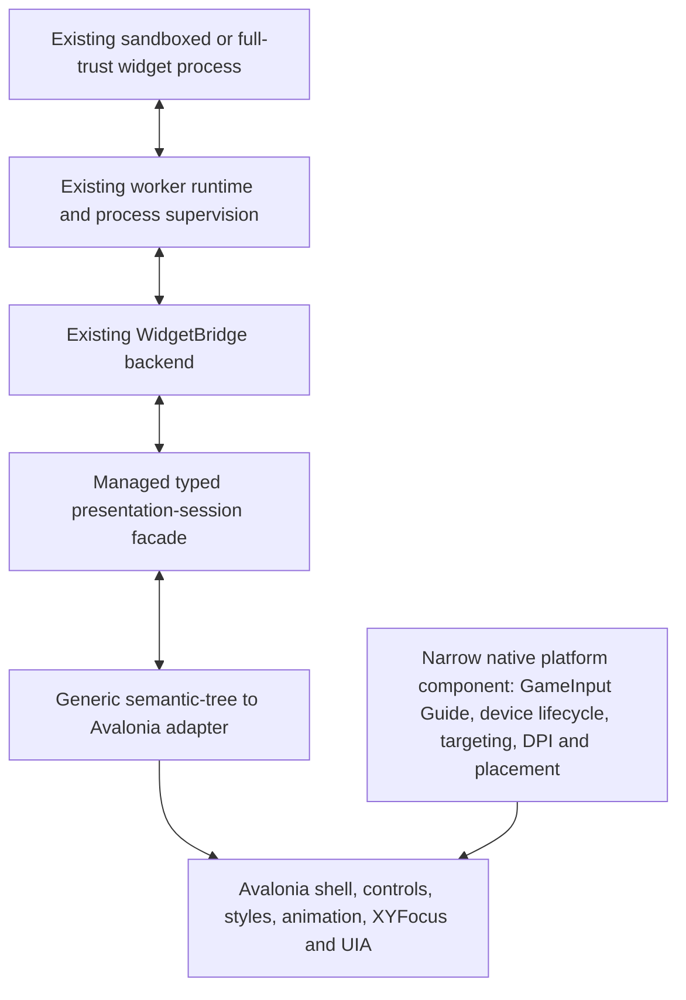

# Avalonia presentation migration plan

Status: accepted architecture direction; implementation remains assignment-gated

Avalonia will replace the overlay's presentation boundary without rebuilding
the widget platform or moving Community widget code into the shell. The
migration preserves the existing process, trust, lifecycle, package, domain,
and semantic contracts and changes how validated presentation state becomes
pixels, focus, animation, and accessibility.

This page defines the target architecture. The active implementation order,
baselines, and acceptance criteria remain in
[the delivery plan](delivery-plan.md).

## Decision

Retain the existing `WidgetBridge` backend and bridge protocol. Replace the
native C++ presentation-side `OverlayHost/WidgetBridgeClient` with a managed,
typed Avalonia-facing session facade.

The word *bridge* therefore names two different responsibilities:

- **Retained backend:** the presentation-neutral service that preserves widget
  process isolation, catalog/runtime ownership, lifecycle, snapshot/action
  validation, failure recovery, and capability boundaries.
- **Replaced presentation client:** the C++ client and renderer-facing parsing
  path currently embedded in the native overlay. Avalonia consumes the same
  backend through a managed `IWidgetPresentationSession`-class facade instead.

Avalonia controls never parse transport messages and never talk directly to a
widget process. The managed facade translates the existing authenticated
transport into typed descriptor, lifecycle, validated-snapshot, exact-action,
artwork, and failure events. One generic semantic-tree adapter maps those
events to standard Avalonia controls.

The native platform component does not render a second overlay, own a second
focus tree, or create another widget protocol. It reports supported OS/input
events to the one Avalonia shell and receives bounded visibility/placement
commands from it.

## Reuse matrix

### Retain without redesign

- `WidgetProtocol`: manifests, view snapshots, validators, stable item/focus/
  action/input-scope identities, responsive surface hints, quick actions, and
  advanced-presentation declarations.
- `WidgetSdk`: lifecycle, navigation, paging/cursor resources, latest-wins and
  optimistic-operation helpers, state, failures, scenarios, and author APIs.
- `WidgetRuntime`, worker hosts, AppContainer workers, and the consented
  full-trust application runtime.
- `WidgetCatalog`, package installation, immutable versions, selection,
  compatibility, enable/disable, update, and removal behavior.
- `WidgetBridge` backend/server, authenticated transport, lifecycle and action
  admission, last-good recovery, and capability routing.
- `PlatformBroker`, bundled Windows providers, `PlatformSettings`, persistent
  state, diagnostics, and current trust/capability decisions.
- Existing bundled widget and Community-package domain implementations. A
  widget continues to publish the same UI-framework-neutral semantic tree.
- Existing deterministic widget/runtime/catalog/package tests and authoring
  workflows, except where an explicitly assigned migration updates a genuine
  presentation expectation.

### Extract or adapt behind a narrow boundary

- Production Microsoft GameInput ownership, including the documented Guide
  system-button callback, background/exclusive Guide policy, device lifecycle,
  visibility-transition quarantine, debounce, and window-thread toggle.
- The quarantined legacy Guide compatibility adapter remains isolated and
  removable; migration must not spread its undocumented API into managed code.
- Overlay state, tray/widget selection, controller ownership, repeat/neutral
  gating, tap/hold Y policy, slider semantics, and Back/entry/exit behavior.
- Monitor targeting, work-area/DPI placement, foreground behavior, pinned-
  surface policy, visibility, and focus restoration.
- Session coordination, restart, timeout, last-good snapshots, action failure,
  text-entry admission, and stale generation/snapshot revalidation.
- Artwork-handle admission and cache policy. Avalonia replaces only the
  renderer-specific D2D bitmap resource.
- Launcher Experience catalog/selection and generic semantic presentation
  declarations. Avalonia supplies the visual templates without identifying a
  package or moving game-domain behavior into the shell.

OS-specific GameInput and Win32 behavior should remain native. Pure policy may
be translated to small managed services when direct C++ interop would be
needlessly chatty, but parity tests must prove the same state transitions,
ownership, stale rejection, and controller semantics before the old owner is
retired. Copying both implementations and leaving two authorities active is
not acceptable.

### Replace with Avalonia

- Native declarative rendering, layout, D2D/DWrite paint, renderer-specific
  image resources, shell/tray visuals, custom motion, and transition code.
- Renderer geometry-based focus projection. Product boundary policy remains;
  target selection uses Avalonia `FocusManager`/`XYFocus` with narrowly scoped
  explicit overrides only where spatial intent is ambiguous.
- The custom rendered-widget accessibility tree. Standard Avalonia controls
  and UIA become the one accessibility tree.
- Native text-entry visuals and other renderer-owned modal surfaces while
  retaining their existing exact action-admission rules.
- GBSS rendering after equivalent product tokens and current supported theme
  behavior have an accepted Avalonia migration. Avalonia styles and control
  themes become the only runtime styling system after cutover.
- Native icon drawing where equivalent repository-owned Avalonia vector assets
  provide the same semantic glyph contract.

### Retire only after accepted cutover

- The native C++ presentation-side bridge client and renderer-specific snapshot
  model after the managed facade covers every current transport operation.
- Direct2D/DWrite layout, composition-surface, renderer animation, native
  widget UIA, and GBSS runtime code after the Avalonia path passes its cutover
  gates.
- AVP-001 through AVP-003 fake pages, fake remote contract, and prototype
  XInput owner once their useful tests are replaced by production-contract and
  production-GameInput evidence.
- Any duplicated native and managed state/navigation policy immediately after
  parity and cutover; pre-release compatibility alone is not a reason to keep
  two owners.

## Generic presentation adapter

The adapter consumes a validated current `ViewSnapshot` and creates standard
Avalonia controls for the protocol's semantic node kinds. It is one renderer,
not a page framework for individual widgets.

It must preserve:

- exact widget instance, runtime generation, snapshot sequence, active input
  scope, source element, action, collection item, and focus persistence IDs;
- closed action authority from the current admitted snapshot;
- responsive visibility, surface hints, grids, scrolling, pagination edges,
  collection anchors, disabled/busy/selected states, quick actions, and
  advanced presentation slots;
- standard control roles, names, values, states, actions, bounds, ordering, and
  one standard Avalonia UIA tree;
- stable semantic focus through virtualization, responsive reflow, snapshot
  replacement, lifecycle transitions, and page switching; and
- UI-thread publication through an explicit presentation scheduler.

It must not contain Spotify, Game Launcher, store, provider, publisher,
package-ID, element-ID, style-class, or known-tree-shape branches. If a feature
cannot be expressed generically, it requires a separately reviewed public
semantic contract exercised by differently named packages—not a domain page.

## AVP-004 execution shape

AVP-004 is a reuse-first migration proof, not eight reconstructed pages.

1. **Managed session boundary:** extract or expose the existing bridge client
   contract as a typed managed presentation facade without changing backend
   authority or introducing another transport.
2. **Native platform boundary:** expose the existing supported GameInput/Guide
   and essential Win32 targeting/placement behavior through one narrow,
   versioned interop surface. Keep the production native host operational while
   the candidate is incomplete.
3. **Generic Avalonia adapter:** replace the AVP fake semantic contract with
   direct use of `WidgetProtocol`, render every current node kind with standard
   Avalonia controls, and connect real lifecycle/action/artwork events.
4. **Real widget coverage:** admit all currently installed bundled and
   Community widgets through their ordinary package/runtime/bridge paths.
   Differences belong in semantic snapshots and generic templates, never in
   handwritten widget pages.
5. **Shell integration and polish:** retain the accepted AVP visual system,
   compiled bindings, virtualization, transitions, XYFocus behavior, standard
   UIA, stationary tray, Back, quick actions, reduced motion, responsive
   containment, and the existing production Guide semantics.
6. **Cutover decision:** compare behavior, resource use, startup, lifecycle,
   accessibility, controller feel, and failure recovery before changing the
   production launcher. Do not remove the native presentation stack until the
   user accepts the candidate and the delivery plan assigns an explicit
   cutover/deletion milestone.

## Acceptance gates

- No fake domain page is needed to display any current widget.
- At least one simple, one provider-backed, one large virtualized, and one
  Community full-application widget run end to end through the existing
  catalog/runtime/bridge and the same generic adapter; final AVP-004 acceptance
  covers every currently installed tray widget.
- Guide, D-pad/stick, A, B, tray cycling, hold-Y behavior, contextual actions,
  reconnect/device loss, focus loss, hide/show, and stale input admission match
  the production policy through the shared semantic router.
- Widget actions are admitted only against the exact current runtime,
  generation, snapshot, element, action, and input scope. Avalonia controls do
  not become a second authority.
- Responsive, text/interface-scale, transition, virtualization, standard UIA,
  visible/hidden CPU and memory, startup, switching, and last-good failure
  evidence is retained with exact commit/runtime provenance.
- Visible private memory remains below the user's 500-MiB ceiling; a result
  above 350 MiB requires ownership analysis before acceptance.
- No production behavior is switched and no legacy renderer is deleted until
  the explicit cutover milestone is independently reviewed and accepted.

## Non-goals

- Loading widgets into the Avalonia process.
- Replacing the bridge backend merely because the UI technology changed.
- Creating a C# GameInput owner alongside the production native owner.
- Rewriting bundled or Community widget domain logic as Avalonia view models.
- Exposing Avalonia, Skia, XAML, controls, or view models in the public widget
  protocol.
- Preserving GBSS and the native renderer indefinitely after an accepted
  clean cutover.
- Using the migration to add credentials, live providers, WebView/video,
  publication, or unrelated product features.
