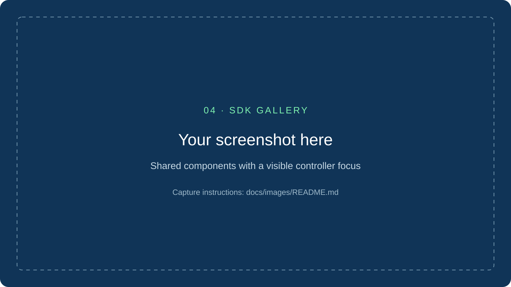

# Build widgets for WidgetRail

You write the behavior of your widget in C#. WidgetRail provides the window,
renderer, controller navigation, and common UI components.

You do not need to modify the host or build its native code to create a widget.
Start with one button, then grow the interface as you need more features.

## Start here

1. [Build your first widget](widget-quickstart.md). Generate a working project and try its action.
2. [Learn the core concepts](concepts.md). Understand what a view describes and how the host uses it.
3. [Change state](widget-model.md). Make an action update the UI.
4. [Add navigation](navigation.md). Build pages and collections that feel natural on a controller.
5. [Style your widget](styling.md). Use the theme instead of hard-coding every color.

## Add the features you need

| Goal | Guide |
|---|---|
| Load data or keep work running at the right time | [Data and lifecycle](data-and-lifecycle.md) |
| Show media, window previews, or a compact pinned view | [Media and pinning](media-and-pinning.md) |
| Control supported Windows features | [Capabilities reference](../reference/capabilities.md) |
| Talk to a local helper application | [Companion services](../reference/community-companion-services.md) |
| Save settings between runs | [Private widget state](../reference/private-widget-state.md) |
| Share a package | [Publishing and installation](publishing-and-installation.md) |

## Learn from complete widgets

SDK Gallery shows individual controls and layout patterns. Audio Mixer and Now
Playing show permission-based Windows integrations. Playnite demonstrates game
posters and paged browsing; Spotify demonstrates music browsing and playback.

Use the examples that match your widget's runtime. Sandboxed widgets use the
shared host and approved capabilities. Full-access applications use a separate
bootstrap and have ordinary user-level Windows access. They are not interchangeable
security models. [Understand the boundary](../maintainers/security-and-trust.md).

## When you need exact details

The [SDK reference](../reference/sdk-reference.md) retains the detailed API map,
advanced examples, and runtime rules. The [CLI workflows](../reference/cli-workflows.md)
cover scenario preview, input replay, package versions, and recovery tools.
You do not need to read either cover to cover before starting.
