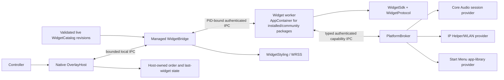

# Platform architecture

Status: current architecture; release/security validation is tracked separately

The platform separates the always-resident native overlay from managed widget
logic. The host owns the window, pixels, focus, controller policy, and
persistence. Sandboxed widgets return bounded semantic UI snapshots. Full-trust applications
are a separate explicitly approved execution model, and embedded web media is
a separate host-managed surface. See [Security and trust](security-and-trust.md).

The native presentation stack below remains the current accepted product. Its
process, trust, lifecycle, package, domain, rendering, focus, accessibility,
GameInput/Guide, and Win32 targeting/placement boundaries are authoritative.

## Components

| Component | Implemented responsibility |
| --- | --- |
| `src/OverlayHost` | Per-Monitor-V2 Win32/Direct2D panel/backdrop shell, active-monitor/work-area/DPI retargeting, responsive logical viewport, GameInput-first Guide handling plus a quarantined compatibility adapter, visible controller polling, spatial focus plus explicit protocol-v13 cross-presentation focus persistence, dashboard/reorder state, last-widget persistence, managed-bridge client, live catalog/appearance revisions, a private exact-Settings modal `.wrwidget` picker/import prerequisite, and generic reference-widget rendering. |
| `src/WidgetBridge` | Disposable managed sidecar with a current-user-only host pipe. `WidgetBridgeServer` owns the pipe session, framing, request routing, reserved Stop lane, replies, and serialized writes; one internal client registry owns catalog revisions, worker generations, residency admission, idle unload, restart, replacement/removal, and terminal client disposal. The bridge also owns trusted mandatory community AppContainer selection, exact current-Settings local-package admission plus locked-stream catalog publication, per-session verified-content lease handoff, controller forwarding, PID-bound capability companion creation, invalidation/failure events, no-poll platform appearance/revisions, and globally layered computed WRSS styles. |
| `src/WidgetRuntime` | Lazy worker process client/server, host-derived content-generation AppContainer profiles for installed/community packages, exact non-inheriting verified-file grants, stripped environments, Low-integrity/capability-free token verification, random PID-bound pipes, bounded length-prefixed JSON, lifecycle/timeouts/restarts, and pre-launch content/residency leases plus Job Object process-tree accounting/UI/cleanup policy. |
| `src/WidgetWorkerHost` | Generic installed-package worker executable. It loads one public concrete SDK `Widget` entrypoint and package-contained managed/native dependencies inside the mandatory AppContainer, connects an authenticated broker client when declared, attaches typed host services before creation, then serves the normal runtime protocol. |
| `src/WidgetProtocol` | Strict manifest and snapshot models, deterministic JSON, tree/focus/action validation, nested input scopes, images, semantic icons, quick actions, and interaction state. |
| `src/WidgetSdk` | Typed authoring API, scoped controller routing, render invalidation, activity lifecycle/tickers, focus helpers, shortcuts, state helpers, transport-neutral capability client, and typed audio/network/Bluetooth/recent-activity/app-library/media services/DTOs. |
| `src/WidgetStyling` | Safe WRSS parser, imports, variable/cascade resolution, explicit trusted layer priority, bounded typed properties, and source-located diagnostics. |
| `src/PlatformSettings` | Strict atomic appearance and trusted app-library source settings, version-pinned development theme discovery, built-in theme, platform/widget/user layer composition, last-good reload, and bounded publisher/package-scoped public widget configuration. The bridge/native shell consume live appearance revisions; credentials never belong in `widget-config`. |
| `src/WidgetCatalog` | Safe `.wrwidget` inspection, version-addressed no-overwrite extraction, full verified path/length/hash inventories, session-scoped byte-pinning launch leases, catalog-owned pre-publication policy under the cross-process operation lock, discovery, enablement/order persistence, schema-1 migration, and fail-closed exact active-version pins. The bridge consumes enabled compatible packages through complete validated live revisions. |
| `src/PlatformBroker` | Version-1 audio/network/Bluetooth/recent-activity/app-library/media/companion capability contracts plus the separate host-granted private-state service; nonce/identity-bound named-pipe transport, declaration/consent/lifecycle enforcement, strict bounded DTOs/events, atomic consent persistence, coalesced subscription/revocation, composable provider interfaces, and a deterministic simulator. |
| `src/WindowsAudioProvider` | Lazy event-driven Core Audio integration for master/per-session volume/mute, sanitized device enumeration, default-microphone volume/mute, and brokered default-device selection. Switching normal Console/Multimedia roles preserves communications settings; it does not capture audio samples. |
| `src/WindowsNetworkProvider` | Lazy event-driven IP Helper/Native Wi-Fi integration for coarse state, explicit nearby scans, opaque saved/open connection, software-radio control, and attempt-unique host-owned WPA2/WPA3 Personal profile creation. Password/profile XML never enters a widget worker; mutable password owners are zeroed, and rollback requires matching per-profile custom ownership data before deletion. Current SSID/signal is not queried automatically. |
| `src/WindowsBluetoothProvider` | Lazy WinRT software-radio and sanitized bounded device discovery, explicit association pairing/removal for one current opaque ID, and a separately granted Windows Settings management fallback. Native IDs remain host-only. It does not offer generic/profile-agnostic device connection. |
| `src/WindowsActivityProvider` | Lazy WinEvent foreground/destroy observation with bounded opaque read-only running-app summaries; no polling, registry history, public process identifiers, switching, or relaunch. |
| `src/WindowsAppLibraryProvider` | Lazy bounded Start Menu, current-user AppsFolder, supported installed Microsoft/Xbox package-game, Steam, and opt-in local Epic installed-game sources behind one normalized private source contract. Epic reads only the fixed ProgramData manifest root and performs no sign-in or network access. Package paths, AUMIDs, configuration/manifest data, launcher identifiers, arguments, PIDs, and raw identities never enter widget payloads. Short-lived launch IDs and authority-scoped durable SavedIds remain opaque. Launch revalidates the owning shortcut/package/AUMID/manifest immediately before constrained activation. |
| `tools/WrailCli` | Widget scaffolding/validation/render/replay, deterministic package creation, bounded HTTPS/GitHub Release acquisition, catalog install/list/enable/disable, and immutable version list/select/rollback commands. It is not a production sandbox or signed marketplace client. |

## Snapshot flow

1. The native host requests a widget snapshot from the bridge.
2. The bridge lazily starts the configured first-party worker or the generic
   installed-package worker host if necessary.
3. The worker calls `Widget.Render()` and validates the resulting semantic
   tree before serializing it.
4. The bridge resolves the widget's trusted WRSS file and returns typed render
   styles beside the validated snapshot.
5. The native host renders known semantic nodes and routes controller events
   using stable IDs and declared focus/action metadata.
6. A widget calls `Invalidate()` after visible state changes. Invalidation
   travels back to the host, which requests a fresh snapshot.

Controller shortcut lookup is local to the active input scope in that exact
snapshot. The root is the default scope; nested Stack/Row scopes can reuse a
binding and never fall through into parents or siblings. Dashboard quick
actions use a separate contract, while Guide remains host-owned.

The snapshot publishes `ActiveInputScopeId`; the host does not infer it from
focus. Each open-widget event echoes that ID and the snapshot sequence it was
rendered from. The SDK rejects stale/mismatched input before action resolution,
so an old press cannot activate a binding after a rerender changes the active
surface. The host owns live focus and remembers it by widget and scope, falling
back to the snapshot's `InitialFocusId` or first focusable Button/Slider.
Disabled and Busy controls remain focusable but do not dispatch actions, so an
async state transition does not teleport focus. A focusless scope remains
valid and can use a Stack/Row/Scroll-level shortcut such as modal B.

All transport messages have explicit size limits, protocol versions, strict
camel-case JSON, and unknown-member rejection. The native process never loads
third-party managed assemblies.

### Bridge request scheduling

The bridge server owns session framing, request decoding and routing, the
reserved Stop lane, replies, and the serialized write path. An
internal request dispatcher owns the independent scheduling policy: unique
request IDs, the global admitted-request bound, per-widget FIFO tails,
session-fatal cancellation, and bounded drain. One closed typed classifier maps
every known post-handshake request and its strictly decoded payload to a global
or canonical widget scheduling key; malformed and unknown requests never gain
an implicit widget key. Each admitted entry is removed from the active-ID and
widget-tail registries on success, failure, or cancellation.

Drain cancels admitted work and enforces a two-second production deadline. If a
handler ignores cancellation, the dispatcher releases its request ID, FIFO
tail, and capacity slot at that deadline, but retains the continuing task in an
observed quarantine until it actually terminates. The canceled request token
prevents a late reply, and a quarantined late failure cannot become a fatal for
the closed or replacement session. This is bounded session teardown, not a
claim that cancellation can terminate arbitrary managed code.

One internal client registry owns the current catalog revision, configured
descriptors, worker generations, residency leases/budget, cached snapshots,
restart, replacement/removal, idle-unload tasks, and terminal client disposal.
Request handlers exchange typed commands and immutable status/snapshot values
with that registry; the server has no registration dictionary or catalog/
residency mutation lock. The per-client operation gate remains inside the
registry as a worker-lifecycle and residency mutex. It coordinates an admitted
operation with idle unload and catalog retirement, which do not enter the
request dispatcher; it is not a second FIFO or request-admission mechanism.
Canceled idle-unload work is retained, boundedly drained, and observed through
terminal retirement so a stale generation cannot unload or publish into its
replacement.

Native resize motion is owned by the existing DirectComposition surface owner.
The destination is rendered at its final authored extent before a bounded
140 ms cubic scale/offset animation is attached with that frame. Drawing does
not consume the motion duration. The UI cadence mirrors progress for hit testing
and accessibility; it never overwrites the compositor animation with timer
samples. Retargeting samples the previous motion when the replacement frame is
ready. Ordinary content or artwork repaints retain the existing transform.
The transparent container keeps the union of current and destination bounds
through completion, avoiding a separate HWND shrink racing the final transform.
Fixed tray/guide anchors and destination layout remain independent of the motion.
Content reveal opacity also runs on the existing content visual without repeated
widget rasterization. Reduced motion snaps the transform and opacity; systems
using the legacy layered fallback retain the existing UI-owned animation path.

Opening and closing add a 12% zoom (88%-to-100%) on the existing content root,
paired with compositor-owned shell opacity (140 ms open, 100 ms close). This
transform is independent of the resize transform and is anchored at bottom
center. Fixed tray/guide coordinates remain unchanged. Widget changes retain
the existing fade and resize behavior without directional translation.
Reduced Motion snaps the zoom and fade. Hit testing and accessibility mirror
the zoom without owning compositor progress.
Generation replacement is one registry transition. A retiring registration
remains the widget's reserved slot until its admitted publications, idle work,
client, residency lease, and operation gate reach terminal cleanup; concurrent
requests wait for that slot instead of creating another generation. Snapshot,
action, lifecycle, controller, restart, host-effect, invalidation, and failure
results carry an internal exact-generation publication lease through the
server's actual serialized reply/event send. Replacement can mark the old
generation closed to new admission, but cannot install or expose its successor
until those admitted sends release. Worker notifications enter one bounded
per-generation lane: the latest queued invalidation replaces an older queued
invalidation, while at most 32 non-coalescible action/runtime failures retain
FIFO order. Full, closed, and coalesced results create no new publication
lease; an accepted item owns exactly one lease until send, cancellation, or
retirement drain. Lane cancellation can withdraw a queued event before writer
admission. One internal frame-write boundary owns serialized admission for both
ordinary replies and events, the unchanged four-second in-flight deadline, and
session abort through one server adapter to the real frame channel. After frame
writing begins, request or publication cancellation no longer interrupts the
frame; timeout ends that pipe session before any
subsequent frame can follow a possibly partial write. Framing bytes and the
public protocol are unchanged.

When a background widget begins visible activation, the registry retains the
latest invalidation until lifecycle/presentation admission commits. This covers
provider data arriving after the first loading frame was captured. A successful
commit releases one refresh demand through the existing notification lane;
failed or retired activation discards it. Ordinary background suppression and
the atomic lifecycle/presentation commit remain unchanged.

Catalog identity mutation only reserves retirement under the registry gate;
notification cancellation, operation drain, and external client disposal start
after that gate is released. Cancellation or the internal restart deadline
abandons fresh-worker publication but leaves the old reserved generation in
the same tracked exact-once retirement path. Once that path finishes, waiters
may create one successor. Terminal disposal waits those resource paths and
active retirement tasks, while per-registration resource/terminal completion
outcomes carry the result to every waiter. Terminal disposal attempts every
captured client and retains a bounded
saturating failure count plus the first terminal failure for its shared
outcome.

## Capability flow

1. A complete validated bridge catalog revision supplies package ID, publisher
   ID, instance ID, and a closed required/optional capability declaration set.
2. Each worker start/restart gets a new bridge-owned companion containing the
   fixed identity, declarations, consent store, backend, random pipe, and nonce.
3. The generic worker bootstrap authenticates the complete nonce/identity
   hello and attaches `WidgetHostServices` before `OnCreatedAsync`. Widget code
   receives typed audio/network/app-library/media services, not raw broker JSON.
4. Every operation rechecks the server-fixed declaration, durable grant, closed
   operation shape, and host-owned lifecycle. Read is Visible/Interactive;
   control is Interactive-only.
5. Event subscriptions are capacity-one/coalescing. Background retains only the
   newest pending event; returning Visible/Interactive releases it. Destroying,
   disposal, or reconciled consent revocation terminates the subscription.

`PlatformCapabilityBroker` remains the singular authority and linearization
point for authenticated identity, declarations, consent, lifecycle, request
leases, dashboard gestures, secondary Spotify-scope/loopback-secret admission,
event sequence, revocation, and subscription publication. After an operation is
authorized, an explicit closed capability-domain route delegates only strict
payload decoding, bounded backend projection, and domain effects:

- audio and network/Bluetooth/activity handlers receive only the fixed backend;
- app-library handling receives the fixed backend, authenticated identity, and
  SavedId issuer, and owns the existing bounded session catalog/token cache;
- media/Spotify handling receives the fixed backend and identity plus one
  narrow callback that asks the broker to authorize requested Spotify scopes;
- loopback request/response policy is value-only, while the broker retains the
  concurrency gate and dependent private-secret request lease;
- private-secret and private-state handlers receive only the fixed backend and
  authenticated identity.

The handlers have no consent store, broker lifecycle, request lease,
subscription, gesture, or event-sequence state. Invalid backend events are
projected by the same domain policies before the broker assigns a sequence and
publishes them. This keeps authorization singular while allowing a domain's
closed decoding and validation to change without editing a multipurpose central
operation switch.

The worker cannot send broker lifecycle transitions or elevate itself. The
runtime propagates only host-owned states to the companion server. The trusted
bridge composes the real Core Audio, Windows network, Start Menu app-library,
and media backends. They remain behind the same typed, declared, consented
contract. See [widget
capabilities](../reference/capabilities.md).

The managed Windows network backend retains one dedicated MTA owner thread for
the native adapter and one committed provider-state owner. A closed internal
command policy maps saved/available connection, scan, and radio results; an
owner-thread operation policy orders connection and scan generations and their
deadlines; a reconciliation policy normalizes bounded native snapshots and
opaque identities into immutable values; and a pure event projection maps only
those committed values to the existing broker vocabulary. Timer callbacks can
only enqueue typed deadline commands. A dedicated internal admission owner
keeps the single queue at 128 entries: ordinary admission stops at 124, leaving
four physical deadline positions. If delayed callbacks fill those positions,
the admission owner retains at most one highest-generation overflow value for
connection and one for scan. Overflow values preserve cross-type arrival order
and are promoted only into a newly available FIFO tail position, so stale
callbacks cannot displace the current deadline or move it to an older signal's
position. The owner thread still rejects stale generations. A packed closed/
admission-count state closes the queue without blocking timer or native-
callback threads and lets every in-flight producer balance its reservation
during disposal. Native callbacks, commands, timeout decisions, reconciliation,
and disposal therefore all serialize through the same owner thread. These
boundaries add no capability, protocol, Windows API, or native-adapter
authority.

The Windows network native adapter is also split behind its unchanged internal
provider contract. `WindowsNetworkNativeAdapter` remains the sole owner of the
WLAN, IP-interface, and connectivity-notification handles; their three native
callbacks; adapter generation; event publication; recovery; and terminal
disposal. One adapter-owned lifetime gate serializes registration, use, and
cancellation of all three handles, WLAN callback projection, bounded WLAN policy
transitions, event-publication admission, and close. Trusted event handlers run
outside that gate: disposal first marks the lifetime disposing, suppresses an
admitted callback that has not begun publication, then drains any publication
that already committed before returning. Active, disposing, and terminal are
distinct states, so concurrent external disposal callers wait for the first
caller's exact-once cleanup and publication drain. Reentrant disposal from a
handler does not wait on its own already-started publication; its final unwind
publishes the terminal state and releases any external disposal waiter. The
injected native-call
facade is stateless and retains no handle or callback. Separate connectivity,
WLAN, and radio policies project managed interface facts, parse bounded native
buffers, correlate scan/connection generations, and execute compensating
multi-PHY radio transactions. They receive the current handle only for the
duration of a serialized call and cannot retain lifetime or synchronization
authority. Malformed counts, SSIDs, interface identifiers, and radio buffers
fail closed or are skipped within fixed bounds. Late callbacks re-enter the
single adapter authority and cannot begin publication after terminal disposal.
This
managed split adds no capability, protocol, broker authority, Windows API, or
native OverlayHost behavior.

## Resource behavior

The overlay starts hidden. It retains the Guide system-button callback but
does not continuously render or perform ordinary controller polling while
hidden. Workers start lazily on demand; unexpected exits and request timeouts
are reported through the runtime and bridge.

The managed bridge accepts at most 16 correlated requests at once. Requests
for the same widget execute in receive order, while catalog and other-widget
requests can complete independently; a seventeenth ordinary request receives
the stable `bridge_busy` error. Stop remains a control-lane request even when
all ordinary slots are occupied, cancels cooperative pending work, and waits
for it to release session resources. Duplicate IDs for pending requests fail
the bridge session closed. This provides bounded server/protocol concurrency for
cooperative work, but the shipping native client still sends one request and
performs its correlated read synchronously, so it cannot issue the unrelated
request while the UI thread is blocked. The dispatcher is also not a hard
timeout around synchronous Windows ACL operations: production-client adoption,
authority application, and dispatcher drain remain part of the open aggregate
start-admission design.

On Windows the runtime creates each worker suspended, assigns it to a dedicated
Job Object, then resumes it. The Job admits a non-breakaway helper process tree,
accounts that tree, terminates it on job close, rejects unhandled-exception
continuation, and applies the complete basic UI-restriction set. Optional
manifest memory guidance is diagnostic metadata rather than a private-memory
ceiling.

The managed runtime keeps host lifecycle, restart-budget, and failure policy in
one `WidgetProcessClient`. Each lazy launch creates one `WidgetProcessSession`
which exclusively owns that generation's pipe/channel, serialized writer,
process and Job handles, cancellation, reader and companion tasks, and process/
content leases. Its single shared terminal task detaches and cancels those
resources, fails pending work, observes bounded late cleanup, and releases each
lease exactly once. Resource attachment and process/reader/companion start
admission use the same terminal gate: if Stop wins, a later lease or companion
is disposed at transfer, and process creation cannot begin after that terminal
decision. Stop/Unload serialize with ordinary construction through the one
client lifecycle gate; a bounded fallback terminalizes the session so an
uncooperative prelaunch operation still cannot attach authority later.
A replacement receives a new session object: reader, process-exit, response,
companion, and gesture work must still reference that exact object and acquire
its publication admission before invoking a host event or companion grant.
Terminal disposal closes admission and drains admitted publication. A
cancellation-ignoring grant completion is observed through the old companion
reference and explicitly revoked; it cannot be committed as replacement-session
authority. `WidgetPendingRequests`
owns request IDs and response correlation within one session, while
`WidgetDashboardGestureReservations` owns bounded exact-operation matching and
monotonic expiry within that same session. Request IDs and gesture sequences
may repeat in a later generation without sharing either mutable table. These
are internal ownership boundaries only; worker framing, public protocol,
broker authority, sandbox policy, and native host behavior are unchanged.

Installed/community workers additionally require a package-content-specific
AppContainer. Until signing exists, installation seals the complete normalized
content tree and the host derives a separate unsigned authority ID from that
verified digest rather than manifest publisher text. Different bytes cannot
inherit profiles, consent, or private secrets even if their asserted ID/version
text is unchanged; rollback to the exact verified bytes restores that authority.
Every lazy start or restart first reacquires the published package digest and
complete relative-path/length/hash inventory under a five-second content-
acquisition deadline. The catalog holds read-only handles that deny write/delete replacement
for every verified file through the exact worker session. The runtime removes
any legacy inheriting package-root grant and gives the AppContainer SID direct,
non-inheriting read/execute access only to the verified files and the directories
needed to traverse to them. Changed bytes and namespace entries present during
admission fail before process creation; entries inserted later inherit no worker
authority. The AppContainer identity includes the verified content digest, so a
new content generation cannot inherit direct grants left on an older root. The
runtime applies these content DACL changes as a transaction before creating a
pipe or process. One cross-process authority lock, with a five-second acquisition
limit, serializes whole-DACL snapshots because different generations can touch the same root. Beneath a
protected host-only Local Application Data directory, a bounded schema-2 record
stores at most 2,049 normalized targets and 16 MiB. The host captures every
root, traversal-directory, and file DACL plus its Windows volume/file identity,
writes and flushes that pending record, and only then performs the first
mutation. Each target is opened once without following a final reparse point;
DACL capture, apply, verification, and rollback use that same handle. Each apply
is verified. A reported failure restores and verifies all attempted targets in
reverse, including the target whose write failed; complete rollback clears the
record and returns a stable retryable admission failure.

Process termination between any two mutations leaves a profile-keyed
schema-3 write-ahead record. The root-wide lock still serializes every mutation. A later
start for that profile reopens each target without following its final reparse
point, requires the recorded volume/file identity, and restores and verifies
every recorded DACL or fails closed with the record still pending. A disjoint
profile may continue, but publication scans every other bounded record and
refuses equal, nested, or same-object targets. Corrupt, unknown-version,
reparse-shaped, unwritable, or unflushable
journal state fails before mutation. The profile being controlled cannot read
or write the journal root; this is verified with a real AppContainer token. No
pipe or worker process is created on any journal, apply, rollback, or recovery
failure.

The runtime also rejects pre-existing read/execute grants for any different
AppContainer package SID, including `ALL APPLICATION PACKAGES` and
`ALL RESTRICTED APPLICATION PACKAGES`, before journal publication.
The catalog records the Windows volume/file identity from every directory and
file handle that pins the verified session content. The bridge transports one
bounded typed target list containing path, authority role, and identity; runtime
requires exact bounds, one unique canonical path per target, and a valid identity
for every target. Its authority
handles must match that evidence before journal publication or DACL mutation.
This closes pathname replacement between catalog capture and runtime authority
capture without persisting volatile file IDs in catalog state. Absolute-path
opens still rely on separately checked ancestors rather than handle-relative
component traversal. A host-only service can list bounded sanitized
profile/token/count metadata and retry exact verified restoration; it exposes
no clear or caller-selected path operation. An authenticated user-facing route
to that service remains open. The lease is released only after
the pipe, process, and Job are detached, and every
crash, restart, intentional unload, disable, or shutdown must reacquire it. Exact
ACL application and the subsequent handshake do not yet share that five-second
deadline; the roadmap retains one aggregate start-admission budget as open work.

Before resume, the runtime separately grants access to the generic executable,
creates a small allowlisted environment, and verifies the process is Low integrity with the expected
AppContainer SID and zero capability SIDs. With no network capability, OS work
continues through the trusted typed broker. Random global main and broker pipes
ACL only the desktop host and that SID, allow Low-integrity access, verify the
expected worker PID, and then perform protocol nonce/identity authentication.
Any failure aborts startup; there is no desktop-token fallback.

Trusted bundled Settings remains a temporary Job-only host policy because it
still requires desktop-user resources. YT Music was removed from that policy
and is installed as a normal Community package. A package manifest or worker
message cannot select the exception. Job memory containment is not
a CPU quota, and AppContainer creation does not yet provide disk/profile size
quotas, stale-profile cleanup, or a user-facing audit surface.
Win32k system-call disable is not active because its test configuration caused
CoreCLR DLL initialization failure (`0xC0000142`); the Job Object UI
restrictions remain.

The host sends an explicit stable lifecycle state through the bridge and
runtime. In the current integration, a selected bridge card is `Visible`, its
open surface is `Interactive`, and moving selection or hiding the overlay sends
`Background`. `Created` and `Destroying` are runtime-owned. Once launched, the
worker remains resident in Background by default. The SDK cancels the shared
Visible/Interactive lifetime while leaving the widget lifetime available to
explicitly permitted background work.

The SDK also creates a token per lifecycle state. It cancels the previous state
token before notifying the widget of the new host-authoritative state, so work
specific to a dashboard preview does not leak into Interactive and vice versa.
Widget authors receive creation, stable-state-change, and bounded destroying
hooks; legacy activation hooks cover the combined Visible/Interactive lifetime.

Process unload is separate from the stable lifecycle states and occurs through
terminal `Destroying`. The planned policy choices are default `keep-alive`,
plus `suspend-when-hidden` and `unload-after-idle` when selected by
manifest/user policy. The host must not invent an idle timeout or resource
heuristic. Policy enforcement is not implemented in the current prototype.

## Settings and theme ownership

The host owns appearance selection, accessibility policy, persistence, and the
final style presented by the renderer. The Settings worker, strict store,
immutable versioned theme catalog, data-only `.wrtheme` installer/tooling,
and bridge are
connected through the generic public widget path. The bridge watches the
settings file/theme tree without polling, debounces events, retains last-good
revisions, and resolves platform → widget → user layers before returning a
snapshot. User layer priority wins before selector specificity.

The Settings worker retains one lifecycle, operation gate, committed-state
lock, and invalidation owner. Its ordinary root/appearance/accessibility/
overlay/diagnostics pages are composed by a pure snapshot presenter; closed
navigation and preference policies return value mutations for the widget to
commit. The preference policy owns only strict settings-store writes and cannot
admit capability or authority-recovery actions. Privileged content-authority
recovery instead uses a separate exact-token policy: selection captures the
reviewed recovery ID and opaque token, retry is authorized only while both
still match the current sanitized diagnostic, and closed results return value
transitions for the widget owner to commit. No opaque token enters the view
snapshot. DLV-044 removes the two residual `SettingsWidget` partial
declarations. Installed-widget selection/version/failure and permission/
consent projection/action rules now accept immutable section state and return
typed value transitions. Their snapshot presenters have no services, locks,
tasks, lifecycle, committed model, or invalidation access. The one non-partial
widget remains the effect adapter that performs catalog, consent, settings,
theme, and diagnostics I/O and commits returned values under the existing
lock. Catalog enablement/version authority and consent/recovery authority stay
in their original stores and services.

The bridge also publishes bounded semantic shell styles and persisted
interface/text scale, backdrop opacity, motion, contrast, bold-text, and
transparency. The native client consumes
the initial payload and later revision events, ignores stale revisions, retains
the last good value on failure, and applies supported shell styles, interface
geometry, backdrop, and accessibility policy without launching or restarting
widget workers. After style resolution, that policy applies non-compounding
text scale, reduced motion/transparency, minimum bold weight, and System/forced
high-contrast text/focus correction to both shell and declarative widgets. The
physical combined 150% visual matrix, auto-scroll, and assistive-technology
integration remain evidence gaps; native graphical theme preview, signing,
removal, and update/rollback are also not implemented.

The implemented contract and remaining native/tooling boundary are documented in
[settings and global themes](../reference/settings-and-themes.md). Theme changes must remain
presentation-only and independent from worker lifecycle.

## Window and input behavior

The visible prototype uses a topmost controller panel plus a non-activating,
uniform black backdrop over the monitor containing the previously foreground
app. Clicking outside the panel on that backdrop closes the overlay. The host
observes foreground and z-order changes and reasserts both windows without
activation after a short settle; hiding removes them from the topmost band and
attempts to restore the prior foreground app.

GameInput's system-button callback is the primary Guide source. A quarantined,
removable XInput adapter covers an observed Xbox-360-class/8BitDo driver gap by
using an undocumented `xinput1_4.dll` ordinal. That fallback is compatibility
evidence, not a supported Microsoft contract or universal device claim.

Ordinary controls use documented XInput while visible. Open-widget navigation
uses a two-dimensional stick state machine with separate engage/release
thresholds and repeat timing. Focus follows a usable explicit neighbor first,
then deterministic geometry from the last render.

## Current limits

- The native renderer is still a reference/prototype implementation. The YT
  Music path is integrated; complete generic rendering of every SDK node and
  every computed WRSS state is still being finished.
- `.wrwidget` pack/install/list/enable/disable and disabled-only version
  list/select/rollback work with the current-user
  catalog. The bridge watches bounded catalog inputs, publishes complete
  last-good semantic revisions, and launches enabled compatible packages lazily
  through the packaged generic worker host. Install accepts local files,
  bounded absolute HTTPS URLs, and exact GitHub Release shorthand. Remote
  sources require SHA-256 and install disabled. Settings provides controller
  package identity/capability review plus enable/disable after CLI installation;
  Settings includes disabled-only exact-version selection/rollback; there is no
  file-picker installer, automatic update discovery, version removal, or
  signature verification. Supported capability declarations receive the authenticated
  broker path; unknown IDs cause that package to be skipped.
- Mandatory capability-free AppContainer launch for installed/community
  workers, exact session-scoped verified-content authority, Job Object process-tree accounting/UI/cleanup policy, PID-bound typed
  capability IPC, consent UI, and prompt fail-closed revocation are implemented
  and tested. Publisher signatures/package revocation, CPU quotas, disk/profile
  quotas and cleanup, security audit/history, migration of trusted built-ins,
  and production hardening/evidence for the Windows providers remain planned.
  The current pieces are therefore not a complete public-distribution trust
  boundary.
- The bundled bridge catalog remains trusted deployment configuration. The
  joined current-user catalog is not a marketplace feed or signed package
  index; enabling a package is not a publisher-trust guarantee.
- The host does not universally suppress controller input seen through every
  game input API. See [controller input](../reference/controller-input.md).
- Topmost behavior is best effort and covers one selected monitor. Responsive
  per-monitor placement, DPI/work-area/topology handling, and deterministic
  tiny/portrait/ultrawide math are implemented. Physical mixed-DPI hot-plug/
  migration and visual-regression evidence remain open. True Fullscreen
  Exclusive, secure desktop/UAC, higher-integrity windows, and injection-based
  or anti-cheat render compatibility are outside the current support target.

See [security and trust](security-and-trust.md) before executing third-party
widgets, [display and resolution](../reference/display-and-resolution.md) for the monitor/
viewport contract, [performance](performance.md) for evidence gates, and
[Platform architecture](../maintainers/platform-architecture.md) for the longer-term technology
rationale.
