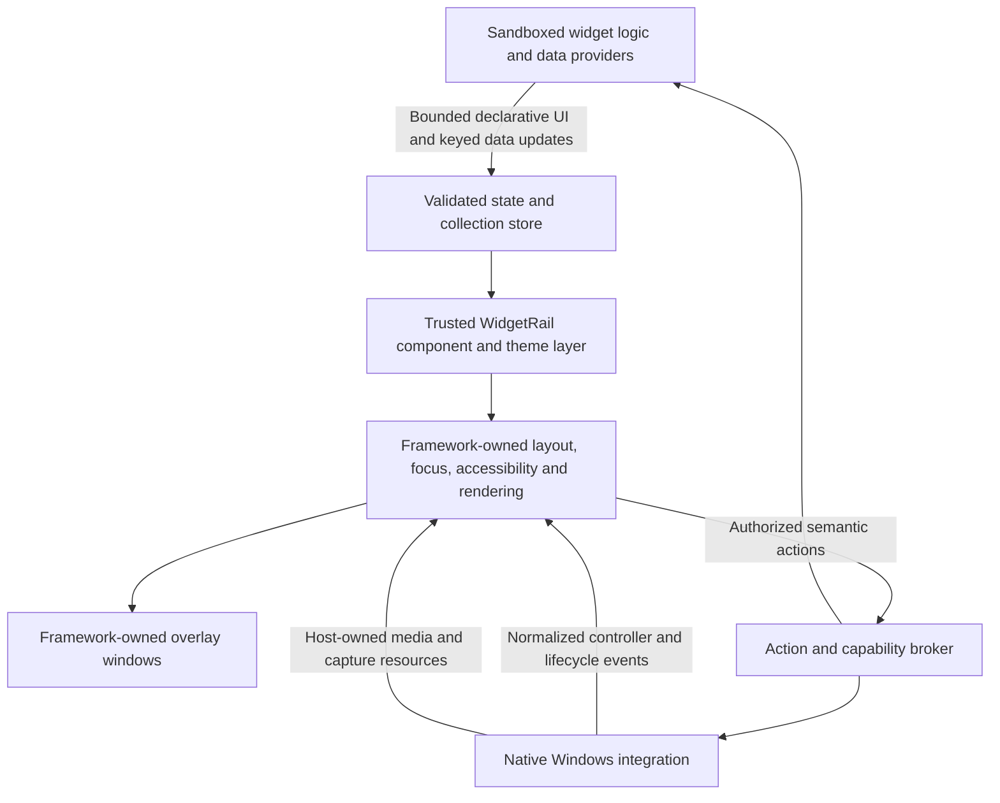

# UI architecture assessment

Assessment date: 2026-09-26. WidgetRail baseline: `092ee64d`.
This is a source-based architecture assessment, not a runtime comparison or a migration decision.

## Recommendation

There are two first-class routes: evolve WidgetRail into a coherent native
lazy/retained UI framework, or adopt an established framework with a redesigned
sandboxed widget model. Both may change the SDK, WRSS, wire protocol and widget
implementations. Neither should be selected to preserve old code or on the strength
of a library's feature list alone.

The [native evolution, animation and graphics assessment](native-ui-evolution-assessment.md)
now supplies the equally concrete native design and effort comparison. It recommends
scoping the native collection/preparation project next while preserving the current
painting backend initially. This supersedes the initial blanket preference for a
framework replacement. Graphics-library adoption is a separate decision from UI
framework adoption.

**Compose Multiplatform is the primary replacement-toolkit candidate for controller-first
navigation and lazy collections. Avalonia is a secondary reference, not the
recommended first implementation.** The user previously tried Avalonia in this
product's early development and reports high memory use for a basic UI and focus
moving to unexpected elements. The version, measurements and reproductions are not
available in this assessment, so this is historical product evidence, not a fresh
benchmark of Avalonia 12.1.3. It nevertheless carries more decision weight than the
mere presence of HWND, UIA or directional-focus APIs.

The initial assessment over-weighted native integration and recommended Avalonia
first without establishing its suitability for those product priorities. That
recommendation is withdrawn. Low resident cost and predictable remote/controller
navigation are primary gates; convenient interop cannot compensate for failing
them. Compose must meet the same gates: its JVM and GPU caches are not evidence of
low memory, and the Android TV experience is not proof of identical Windows behavior.
There is no demonstrated current-version performance winner or migration decision.

Keep the accepted native renderer as the working product and comparison baseline
while evaluating the replacement. Its remaining cost is evidence about the problem,
not a reason to preserve its internals or to assume another backend will solve it.

## Product requirements and freedoms

The user explicitly allows front-to-back breaking changes during preview. The C#
SDK, WRSS, wire protocol, renderer, host window ownership and widget implementations
are replaceable. There is no requirement to run old widgets unchanged or retain the
old pixel/layout semantics. Native code is worth keeping only where its behavior
or integration is useful, not because it has already been written.

The user explicitly confirmed that **sandboxed community widgets must remain**.
Full-trust custom UI in the main application cannot be the only extension model.
Windows/controller-first operation, accessible interaction, themed widgets, media
and window-preview support, responsive collections and bounded background cost are
the current product assumptions. Cross-platform UI is a benefit, not an assumed
requirement to expand the product beyond Windows.

No standalone replacement grid is proposed as a migration decision gate. The test
must exercise the product architecture, including the sandbox boundary and native
integration. No prototype, dependency installation or production change was made
for this assessment.

## What the existing implementation tells us

| Current boundary | Evidence | Architectural implication |
|---|---|---|
| Native host owns layout, focus, pixels and Windows integration | [Platform architecture](platform-architecture.md); [renderer output](../../src/OverlayHost/DeclarativeRenderer.h) | Rendering is coupled to navigation/accessibility geometry. Replacing drawing alone leaves much of the framework intact. |
| Cursor metadata describes an admitted item window | [ViewModels](../../src/WidgetProtocol/ViewModels.cs), `VirtualCollectionWindow`, `CollectionItemKey`; [CursorResource](../../src/WidgetSdk/WidgetCursorResource.cs), `Capture`/`PresentItem` | Stable keys and generation/reset/anchor information are useful design concepts. They are not an item factory or a guarantee of lazy UI realization. |
| Widgets build concrete child trees | [Playnite presentation](../../samples/PlayniteLibraryWidget/PlayniteLibraryPresentation.cs); `ViewNode.Children` | Host-side laziness alone does not eliminate worker construction, serialization, validation and style preparation of those trees. |
| Atomic structural updates already exist | [PresentationUpdates](../../src/WidgetProtocol/PresentationUpdates.cs): insert, remove, move, replace subtree | Do not describe incremental transport as missing. The renderer still conservatively performs full preparation on structural admission. The next model should carry collection operations without requiring eager realization. |
| Layout sessions now retain validated Taffy nodes | [Retained preparation](renderer-preparation-retention.md); [native layout](../../src/OverlayHost/DeclarativeLayout.cpp) | This reduced measurement work; it did not create a complete lazy UI architecture. Full structural style/tree preparation and grid resolution remain. |
| Windows composition is deeply integrated | [OverlayCompositionSurface](../../src/OverlayHost/OverlayCompositionSurface.cpp); [WidgetCompositionPresenter](../../src/OverlayHost/WidgetCompositionPresenter.cpp) | Device, target, visual-tree, texture lifetime and animation ownership must move together or have an explicit integration boundary. |
| WebView2 uses a composition visual target | [RichMediaSurfaceCoordinator](../../src/OverlayHost/RichMediaSurfaceCoordinator.cpp), `put_RootVisualTarget` | A framework's HWND or GPU-texture import support does not automatically host this visual subtree with correct clipping and z-order. |
| Input and accessibility carry action authority | [WidgetInteractionSession](../../src/OverlayHost/WidgetInteractionSession.h); [AccessibilityProvider](../../src/OverlayHost/AccessibilityProvider.h) | Preserve the requirement to reject stale actions, not necessarily these classes or their geometry-based algorithms. |
| Community code executes outside the trusted renderer | [Security and trust](security-and-trust.md) | A JVM class loader or a .NET assembly load context is not a replacement for OS process isolation. |

The latest physical Playnite sample had new-view scrolling renders of 47.244 ms
median / 50.194 ms maximum versus 52.785 / 59.043 ms previously, with 7 versus 9
samples. Ordinary scrolling remained about 9 ms. Separate runs and small samples
do not establish a universal speedup or a migration performance target.

## Framework findings

### Compose Multiplatform

- Compose Multiplatform 1.12.1 was the latest release returned by GitHub during this
  assessment. Its desktop UI runs on the JVM. The runtime, Foundation/lazy layout
  and much of UI are shared/multiplatform implementations derived from Compose;
  Windows does not run the Android framework or Android TV rendering backend.
- `ComposeWindow.windowHandle` exposes the Windows HWND. Transparent, undecorated
  windows are documented. Letting Compose own the main window is consequently a
  credible architecture to evaluate; embedding it into the existing native window
  is not a mandatory constraint.
- `ComposeScene` explicitly documents that its lower-level integration API is
  internal and carries no stability guarantee. `CanvasLayersComposeScene` shares
  that annotation. It is usable for custom hosting, but choosing it creates an
  upstream-version maintenance obligation.
- The 1.12.1 core version catalog selects Skiko 0.150.1. That version defaults to
  Direct3D on Windows unless ANGLE is opted in. Its DirectX 12 renderer creates a
  composition swap chain and owns a DirectComposition target/root for transparent
  presentation. It does not normally paint through Direct2D.
- This corrects an easy oversimplification: Compose Desktop can use
  DirectComposition underneath. It does **not** follow that each Compose animation
  is an independent Windows compositor timeline. The inspected Skiko release
  schedules updates on its UI frame dispatcher and performs drawing/presentation
  through its rendering path. Thread scheduling and layer reuse must be measured.
- Lazy grids expose stable keys and content types and realize content on demand.
  They still require valid state, bounded item work and correct data updates.
  Provider pagination, stale-result rejection and controller hold behavior remain
  application/platform responsibilities.
- The current official desktop accessibility documentation specifies Java Access
  Bridge on Windows, disabled by default, and inclusion of `jdk.accessibility` in
  distributions. This is not equivalent to the current native UIA provider. It is
  a compatibility/deployment gate, not proof that Compose is inaccessible.
- Swing interoperability is documented, including experimental offscreen modes
  with a size-dependent performance penalty. Swing interop does not establish
  arbitrary native HWND or WebView2 composition interoperability.
- Self-contained distributions bundle a trimmed Java runtime; users do not need
  to install a separate JDK. Startup, resident memory and GPU memory are unmeasured.

### What carries over from Android TV navigation

The relevant Compose focus machinery is not confined to Android's window backend.
In the inspected Compose Multiplatform release, `TwoDimensionalFocusSearch`,
`FocusProperties`, `FocusRestorer` and Foundation's `focusGroup` are in `commonMain`.
Directional search can request beyond-bounds layout to realize additional candidates
when a target is outside the current realized set. This integration between focus,
identity and lazy layout is the specific reason Compose warrants examination here.

That is a stronger lead than an API merely naming gamepads, but it is not a promise
of perfect automatic navigation. Default directional search still uses spatial
candidate rules. Rails, navigation bars, modal boundaries and unusual layouts may
need explicit groups, neighbors and restoration policies in shared product
components. Android-only TV controls, remote event delivery and window behavior
are separate; they do not arrive automatically in the Windows implementation.

The inspected Nuvio source also implements app-specific behavior. Its
`DpadFastScrollModifier` intercepts held directional events, frame-paces scrolling,
keeps the originating focus during the gesture and chooses a landing target on
release/edge. Single presses fall through to Compose focus traversal. Its Discover
screen explicitly manages restoration. Therefore the navigation experience comes
from shared Compose infrastructure plus TV/app design, not from the graphics API
or a zero-configuration desktop gamepad mode.

### Avalonia

- Avalonia 12.1.3 was the latest release returned by GitHub. Its standard rendering
  stack includes Skia through SkiaSharp, a retained control/layout tree and a
  compositor with render-thread commit support. Switching to it is also a full
  UI-framework decision, not a Direct2D library swap.
- The Windows implementation has explicit HWND ownership, activation, topmost,
  scaling and transparency behavior. It also uses platform composition paths;
  the application should use supported framework/native-integration APIs rather
  than commandeering internal visual roots.
- Windows accessibility implements UI Automation COM providers directly.
- Public compositor APIs expose optional GPU interoperability and drawing surfaces
  updated from imported GPU images with keyed-mutex or semaphore synchronization.
  This is a promising path for capture/video textures. The API is capability-based
  and may be unavailable for a selected renderer/device. It does not import a
  WebView2 DirectComposition visual tree by itself.
- `NativeControlHost` provides an HWND-hosting extension point. Native child-window
  layering, rounded clipping, transforms and menus above media still require proof.
- Virtualized lists are in the core controls. An official separate ItemsRepeater
  repository supplies `UniformGridLayout : VirtualizingLayout`, realization bounds,
  anchor logic and incremental collection-change handling. Its inspected source
  targets Avalonia 12.0.0; the NuGet index includes a 12.0.0 package. Compatibility
  and performance with 12.1.3 are **not** established by source inspection alone.
  An ordinary `WrapPanel` must not be substituted and called a virtualized grid.
- Directional focus has `XYFocus` properties and gamepad/remote navigation modes.
  This is not a native GameInput device reader or a guarantee of our desired
  offscreen focus/pagination behavior.

### Continuing the native framework

This retains precise Windows composition/media control and avoids adopting another
UI runtime. It is technically capable of further improvement: true lazy realization,
incremental collection preparation and scheduled premeasurement are still available.
However, WidgetRail would keep owning general layout, text, controls, accessibility,
focus and animation correctness. Taffy already solves layout algorithms; the costly
missing work is the broader retained/lazy UI system around it.

The native framework is not proven faster or smaller than either alternative.
Neither replacing it nor retaining it removes the need for resource budgets and
proper scheduling. A Skia-only change would keep most of this maintenance burden
and would not address the measured structural-admission problem by itself.

## Comparison for a new design

| Criterion | Purpose-built native UI | Compose-owned UI | Avalonia-owned UI |
|---|---|---|---|
| General UI infrastructure maintained upstream | Layout/math/graphics libraries, much custom framework work | Strong runtime/layout/lazy/control foundation | Strong retained controls/layout/style/composition foundation |
| Lazy adaptive poster grids | Requires additional framework design | First-class lazy grid APIs | Separate virtualizing ItemsRepeater layout; verify package and behavior |
| Windows overlay and media integration | Already implemented, still maintenance-heavy | HWND available; custom media/composition path needs proof | Native hosting and public GPU import APIs; media path still needs proof |
| Windows accessibility | Custom native UIA | Documented Java Access Bridge path | Native UIA implementation |
| Controller-first product behavior | Already implemented | Product-specific layer on focus/input APIs | Product-specific layer on directional-focus/input APIs |
| Safe arbitrary third-party code in UI process | No | No | No |
| Runtime/distribution | Native host plus chosen worker runtimes | JVM + native Skia/Skiko + chosen worker/platform components | .NET + native Skia/platform components + chosen workers |
| Actual WidgetRail performance | Measured baseline | Not measured | Not measured |

This is a focused shortlist, not a benchmark-based ranking of every UI toolkit.
Flutter, WinUI and Qt have not been ruled out through equivalent tests. There is
currently stronger direct evidence for evaluating these two alternatives than for
expanding into a broad framework bake-off.

## Recommended product architecture

1. **One UI owner.** The chosen framework owns realized controls, measurement,
   focus and rendering. A WidgetRail controller policy maps device input into that
   owner, adds hold-to-scroll/guide behavior, and requests realization of logical
   targets. Do not maintain a parallel native focus engine deciding against stale
   framework geometry. Device acquisition and overlay activation remain a narrow
   native responsibility.
2. **A trusted product component library.** Posters, rails, song rows, guides,
   options, dialogs and controller hints are framework components with consistent
   themes and behavior. First-party UI can use framework code directly. Visual
   design does not have to retain today's layout limitations or appearance.
3. **A redesigned sandbox authoring model.** Community widgets describe safe
   composition, properties, actions and assets using bounded typed data. The host
   creates approved controls. Author SDK language can be chosen independently of
   the UI framework; a Kotlin UI host does not force every data/provider widget to
   be Kotlin. Conversely, preserving the current C# SDK is not a requirement.
4. **Collections are first-class data sources.** Publish stable keys, ordered item
   descriptors, query/reset identity and transactional insert/update/remove/move
   operations. Descriptors may contain bounded declarative content or approved
   templates; they do not contain executable composable/control factories. The UI
   realizes only visible, buffered and specifically retained items. It does not
   synchronously call a worker or provider to construct each visible control.
5. **Presentation demand and data demand are distinct.** The framework handles
   realization/prefetch; the collection service requests provider pages, protects
   visible/focused items, cancels stale requests and applies updates atomically.
   At a missing-content boundary, movement stops without accumulating a backlog.
   Logical identity persists even while its visual control is unrealized.
6. **Themes use the framework's strengths.** Define WidgetRail design tokens and
   bounded component variants on the chosen framework's styles/theme facilities.
   Retire WRSS compatibility if it imposes a second layout/style engine. User theme
   customization remains a product feature; unrestricted community XAML, reflection,
   converters, composable classes or executable theme code do not become trusted input.
7. **Native media is an explicit interface.** Define resource ownership, native
   hosting/import capabilities, clips, z-order, input, device loss, hidden/pinned
   lifetime and retirement before building media widgets. Audio providers need not
   live on the UI thread or stop when a visual is unrealized.
8. **Actions stay authority-checked.** Framework focus IDs are not permission tokens.
   A queued click, accessibility action or controller command must still belong to
   the current widget/query/lifecycle and valid target when delivered.

This retains a declarative widget boundary because the sandbox/unified-product
requirements justify it. It does not retain the existing syntax or semantics as
legacy obligations. A mature UI framework reduces low-level framework work; it does
not eliminate the widget contract, resource governance or permission system.

## Extension-model tradeoff

| Model | Sandbox and flexibility | Assessment |
|---|---|---|
| Approved host components driven by declarative widget data | Strong process separation; authors compose the supported safe vocabulary | Recommended starting point. Expand expressive primitives/components deliberately. |
| Arbitrary widget UI code in the main Compose/Avalonia process | Full framework API, but shares trusted process authority and failure domain | Reject for community widgets under the user's sandbox requirement. |
| A separate sandboxed UI-rendering process per widget | Potentially full custom UI while keeping code outside the host | Possible research direction, not ruled out. Requires a proven process sandbox, GPU/pixel transport, cross-surface focus/accessibility, lifecycle, budgets and safe resource sharing. Neither toolkit supplies this product architecture automatically. |

The third option can preserve more author freedom, but adds a distributed rendering
system and potentially more UI-runtime processes. Its memory, startup, GPU sharing
and security properties are unmeasured. Do not assume a class loader, JIT setting or
packaging mechanism provides that isolation. Also do not assume a shared texture
proves every interaction or accessibility requirement works.

## Replacement scope

| Area | Preferred direction if an established framework is selected |
|---|---|
| Taffy/DeclarativeRenderer and custom control painting | Replace with framework layout and controls. Retain only a deliberately required specialized drawing integration. |
| DirectComposition UI scene/animation machinery | Replace UI responsibilities with framework composition. Keep native platform/media integration only through a clear supported boundary. |
| WRSS and current UI SDK | Redesign; no pixel-compatibility promise. Themes, component variants and author ergonomics remain requirements. |
| Worker presentation protocol | Redesign around safe components and keyed data/collection transactions. Existing atomic-update concepts can inform it; old wire compatibility is optional. |
| Controller policy and focus persistence | Port desired behavior into the framework focus/collection model. Keep logical item/scope identity, not two independent geometry owners. |
| Providers, playback, secrets and capabilities | Reuse or rewrite according to quality and isolation needs; do not move provider I/O or untrusted code into UI callbacks. |
| Packaging, trust and lifecycle | Preserve product guarantees, redesign runtime packaging as needed. A package signature alone is not a sandbox. |
| Widgets | Rebuild UI against the new component model where appropriate. Existing provider/data logic is useful evidence, not a compatibility obligation. |

## Decisive integrated gates

Two criteria have priority throughout every gate:

- **Predictable focus:** define expected item/group transitions for taps, holds,
  reversals, row edges, loading, item removal and modal entry/exit. Assert logical
  target IDs and scope ownership, not just a visible focus ring. Shared components
  should encode policy; repeated widget-specific focus patches are a negative result.
- **Bounded memory:** measure the complete process tree and GPU resources for a
  basic empty/light widget, populated library, sustained traversal, hide/show and
  widget retirement. Separate private committed memory, working set, reserved heap,
  decoded artwork and GPU allocations; compare equivalent content and lifecycle.
  Agree numeric budgets from the accepted product baseline rather than inventing
  an absolute limit or assuming either managed runtime is lighter.

For the replacement-toolkit route, the next implementation, if authorized, should
be an integrated replacement-host vertical slice on its own branch. It should not be a visually similar standalone benchmark or a
promise to translate every legacy widget first.

| Order | Deliverable | Pass/fail evidence |
|---|---|---|
| 1. Windows shell, navigation and resident cost | Compose-owned transparent overlay, native controller activation and representative navigation groups; establish a basic-UI memory baseline immediately | Deterministic focus through lists/rails/modal scopes; show/hide/reopen, monitor/DPI transitions and input ownership. Reject unacceptable basic-UI resource cost before investing in a full widget port. |
| 1b. Native surfaces | One native video/web surface and one capture texture in the same host | Rounded clipping, menus/dialogs above media, hidden/pinned lifetime and device-loss recovery. Fail the path if it requires routine full-frame CPU readback or brittle internal patches without an explicitly accepted tradeoff. |
| 2. Real sandbox boundary | One sandboxed provider worker and the new safe UI/collection contract | Worker cannot inject UI-process code; malformed/over-budget state is rejected; crash/restart and stale actions do not corrupt the UI or another widget. A trusted in-process demo does not pass this gate. |
| 3. Representative product flows | Playnite-backed library/details plus a music-style variable-height list and inline modal | Tap/hold/reversal, loading edges, append/prepend/eviction/reset, focus restoration, text scaling, themes, accessibility and playback updates together. Frontends can be redesigned rather than preserve old widgets. |
| 4. Controlled performance and resource comparison | Same device, artwork, provider timing, visual complexity and display settings across candidates | Frame-time distributions, input-to-visible latency, admission costs, CPU/GPU/RSS and cold start; include a real desktop compositor path. WIC or an isolated grid is supplementary evidence only. |

At a fixed viewport, increase available data size and confirm that expensive UI
realization/measurement follows visible/changed content instead of all loaded items.
Allow bounded metadata reconciliation to scale; do not claim all work is constant.
Use warm/cold artwork and deliberate delayed, failed and obsolete page responses.

A proposed initial 60-Hz goal is p95 interactive frames within 16.7 ms, with page
arrival not introducing repeated frames above 33.3 ms. This is a target for deciding
whether a candidate solves the observed problem, not a measurement already achieved
or a universal guarantee for arbitrary widget content. Test higher refresh rates
separately and agree final resource budgets before selecting a production backend.

Apply these navigation, memory, platform and sandbox criteria to both native
evolution and a Compose replacement. The companion report recommends a scoped
native collection/preparation delivery as the next implementation, with an explicit
reassessment gate. If Compose is evaluated and meets the integrated criteria, it
remains a credible migration direction. Identify toolkit limitations separately
from integration defects; compare concrete costs rather than assuming either path
is inherently faster or cheaper. Revisiting Avalonia requires an explanation or
evidence addressing the user's earlier memory/focus failures; its integration APIs
alone do not justify repeating that trial.

## Evidence and limits

No Compose/Avalonia runtime was installed or run as part of this assessment. No throughput, memory, accessibility
or media integration superiority is claimed from source alone. The assessment uses
the following pinned sources; downloaded references remain in ignored research
artifacts, not vendored product code.

- [Compose Multiplatform 1.12.1 release](https://github.com/JetBrains/compose-multiplatform/releases/tag/v1.12.1).
- [Compose core release source](https://github.com/JetBrains/compose-multiplatform-core/tree/a1a7f3533363aa93849541cf451af2363fc2070a):
  [window HWND](https://github.com/JetBrains/compose-multiplatform-core/blob/a1a7f3533363aa93849541cf451af2363fc2070a/compose/ui/ui/src/desktopMain/kotlin/androidx/compose/ui/awt/ComposeWindow.desktop.kt#L330),
  [scene API stability](https://github.com/JetBrains/compose-multiplatform-core/blob/a1a7f3533363aa93849541cf451af2363fc2070a/compose/ui/ui/src/skikoMain/kotlin/androidx/compose/ui/scene/ComposeScene.skiko.kt#L68),
  [lazy grid API](https://github.com/JetBrains/compose-multiplatform-core/blob/a1a7f3533363aa93849541cf451af2363fc2070a/compose/foundation/foundation/src/commonMain/kotlin/androidx/compose/foundation/lazy/grid/LazyGridDsl.kt),
  [Skiko dependency](https://github.com/JetBrains/compose-multiplatform-core/blob/a1a7f3533363aa93849541cf451af2363fc2070a/gradle/libs.versions.toml#L81).
- [Skiko 0.150.1 native Windows presentation](https://github.com/JetBrains/skiko/blob/3956e988e6e93eaf1ee985d725049443e7845807/skiko/src/awtMain/cpp/windows/directXRedrawer.cc#L83)
  and [frame scheduling](https://github.com/JetBrains/skiko/blob/3956e988e6e93eaf1ee985d725049443e7845807/skiko/src/awtMain/kotlin/org/jetbrains/skiko/redrawer/Direct3DRedrawer.kt#L47).
  The earlier conversation inspected a newer Skiko main commit; this report instead
  follows the dependency pinned by the selected Compose release.
- Current official Compose documentation:
  [windows](https://kotlinlang.org/docs/multiplatform/compose-desktop-top-level-windows-management.html),
  [Windows accessibility](https://kotlinlang.org/docs/multiplatform/compose-desktop-accessibility.html),
  [Swing interop](https://kotlinlang.org/docs/multiplatform/compose-desktop-swing-interoperability.html),
  [self-contained distributions](https://kotlinlang.org/docs/multiplatform/compose-native-distribution.html).
- Shared Compose focus implementation in the selected release:
  [two-dimensional search and beyond-bounds realization](https://github.com/JetBrains/compose-multiplatform-core/blob/a1a7f3533363aa93849541cf451af2363fc2070a/compose/ui/ui/src/commonMain/kotlin/androidx/compose/ui/focus/TwoDimensionalFocusSearch.kt),
  [explicit directional destinations](https://github.com/JetBrains/compose-multiplatform-core/blob/a1a7f3533363aa93849541cf451af2363fc2070a/compose/ui/ui/src/commonMain/kotlin/androidx/compose/ui/focus/FocusProperties.kt),
  [focus restoration](https://github.com/JetBrains/compose-multiplatform-core/blob/a1a7f3533363aa93849541cf451af2363fc2070a/compose/ui/ui/src/commonMain/kotlin/androidx/compose/ui/focus/FocusRestorer.kt),
  [focus groups](https://github.com/JetBrains/compose-multiplatform-core/blob/a1a7f3533363aa93849541cf451af2363fc2070a/compose/foundation/foundation/src/commonMain/kotlin/androidx/compose/foundation/Focusable.kt).
- Nuvio reference implementation:
  [held D-pad scrolling](https://github.com/NuvioMedia/NuvioTV/blob/d8c500175b08e0a1a3fd8da9fc9f4bfe89ff4c96/app/src/main/java/com/nuvio/tv/ui/util/DpadFastScrollModifier.kt),
  [Discover restoration](https://github.com/NuvioMedia/NuvioTV/blob/d8c500175b08e0a1a3fd8da9fc9f4bfe89ff4c96/app/src/main/java/com/nuvio/tv/ui/screens/search/DiscoverScreen.kt).
  This is app code on Android; desktop transferability has not been runtime-tested.
- [Avalonia 12.1.3 source](https://github.com/AvaloniaUI/Avalonia/tree/8eeda4f6f546165b3f72e63c9f42247abb306905):
  [Win32 windows](https://github.com/AvaloniaUI/Avalonia/blob/8eeda4f6f546165b3f72e63c9f42247abb306905/src/Windows/Avalonia.Win32/WindowImpl.cs),
  [UIA root](https://github.com/AvaloniaUI/Avalonia/blob/8eeda4f6f546165b3f72e63c9f42247abb306905/src/Windows/Avalonia.Win32.Automation/RootAutomationNode.cs),
  [GPU interop](https://github.com/AvaloniaUI/Avalonia/blob/8eeda4f6f546165b3f72e63c9f42247abb306905/src/Avalonia.Base/Rendering/Composition/Compositor.cs#L311),
  [imported image updates](https://github.com/AvaloniaUI/Avalonia/blob/8eeda4f6f546165b3f72e63c9f42247abb306905/src/Avalonia.Base/Rendering/Composition/CompositionDrawingSurface.cs),
  [native control hosting](https://github.com/AvaloniaUI/Avalonia/blob/8eeda4f6f546165b3f72e63c9f42247abb306905/src/Avalonia.Controls/NativeControlHost.cs),
  [directional focus](https://github.com/AvaloniaUI/Avalonia/blob/8eeda4f6f546165b3f72e63c9f42247abb306905/src/Avalonia.Base/Input/Navigation/XYFocus.Properties.cs),
  [Skia rendering](https://github.com/AvaloniaUI/Avalonia/blob/8eeda4f6f546165b3f72e63c9f42247abb306905/src/Skia/Avalonia.Skia/PlatformRenderInterface.cs).
- [ItemsRepeater virtualized uniform grid](https://github.com/AvaloniaUI/Avalonia.Controls.ItemsRepeater/blob/ab77648f78ceb715138642d01546bc1710229a00/src/Avalonia.Controls.ItemsRepeater/Layout/UniformGridLayout.cs),
  [source dependency version](https://github.com/AvaloniaUI/Avalonia.Controls.ItemsRepeater/blob/ab77648f78ceb715138642d01546bc1710229a00/Directory.Build.props),
  [published package versions](https://api.nuget.org/v3-flatcontainer/avalonia.controls.itemsrepeater/index.json).

Avalonia documentation requests returned HTTP 403 in this environment; relevant
claims above were checked against its source instead. A repo/class/API existing is
evidence of an integration mechanism, not a passed WidgetRail integration test.
