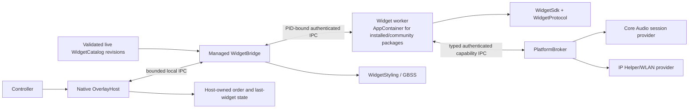

# Platform architecture

Status: implemented prototype boundaries, not a production security boundary

The platform separates the always-resident native overlay from managed widget
logic. The host owns the window, pixels, focus, controller policy, and
persistence. Widgets return bounded semantic UI snapshots; they do not create
windows, draw arbitrary paths, inject into games, or ship browser UI.

## Components

| Component | Implemented responsibility |
| --- | --- |
| `src/OverlayHost` | Per-Monitor-V2 Win32/Direct2D panel/backdrop shell, active-monitor/work-area/DPI retargeting, responsive logical viewport, GameInput-first Guide handling plus a quarantined compatibility adapter, visible controller polling, spatial focus, dashboard/reorder state, last-widget persistence, managed-bridge client, live catalog/appearance revisions, and generic reference-widget rendering. |
| `src/WidgetBridge` | Disposable managed sidecar, current-user-only host pipe, last-good no-poll catalog monitoring with semantic revisions, trusted host selection of mandatory community AppContainer policy, worker preservation/retirement, controller forwarding, PID-bound capability companion creation, invalidation/failure events, no-poll platform appearance/revisions, and globally layered computed GBSS styles. |
| `src/WidgetRuntime` | Lazy worker process client/server, stable host-derived AppContainer profiles for installed/community packages, explicit read/execute grants, stripped environments, Low-integrity/capability-free token verification, random PID-bound pipes, bounded length-prefixed JSON, lifecycle/timeouts/restarts, and pre-launch Job Object memory/process/UI/cleanup policy. |
| `src/WidgetWorkerHost` | Generic installed-package worker executable. It loads one public concrete SDK `Widget` entrypoint and package-contained managed/native dependencies inside the mandatory AppContainer, connects an authenticated broker client when declared, attaches typed host services before creation, then serves the normal runtime protocol. |
| `src/WidgetProtocol` | Strict manifest and snapshot models, deterministic JSON, tree/focus/action validation, nested input scopes, images, semantic icons, quick actions, and interaction state. |
| `src/WidgetSdk` | Typed authoring API, scoped controller routing, render invalidation, activity lifecycle/tickers, focus helpers, shortcuts, state helpers, transport-neutral capability client, and typed audio/network/Bluetooth/recent-activity services/DTOs. |
| `src/WidgetStyling` | Safe GBSS parser, imports, variable/cascade resolution, explicit trusted layer priority, bounded typed properties, and source-located diagnostics. |
| `src/PlatformSettings` | Strict atomic appearance settings, version-pinned development theme discovery, built-in theme, platform/widget/user layer composition, and last-good reload. The bridge/native shell consume its live revisions, including bounded text scale for shell and generic widget layout. |
| `src/WidgetCatalog` | Safe `.gbarwidget` inspection, immutable extraction, discovery, enablement/order persistence, schema-1 migration, and fail-closed exact active-version pins. The bridge consumes enabled compatible packages through complete validated live revisions. |
| `src/PlatformBroker` | Version-1 audio/network/Bluetooth/recent-activity capability contracts, nonce/identity-bound named-pipe transport, declaration/consent/lifecycle enforcement, strict bounded DTOs/events, atomic consent persistence, coalesced subscription/revocation, composable provider interfaces, and a deterministic simulator. |
| `src/WindowsAudioProvider` | Lazy event-driven Core Audio integration for master/per-session volume/mute, sanitized default-device visibility, and current default-microphone volume/mute. It does not switch default devices or capture audio samples. |
| `src/WindowsNetworkProvider` | Lazy event-driven IP Helper/Native Wi-Fi integration for coarse state, explicit nearby scans, opaque saved/open connection, and software-radio control. It does not handle credentials/profile XML or query current SSID/signal automatically. |
| `src/WindowsBluetoothProvider` | Lazy WinRT software-radio and sanitized bounded device discovery. It does not pair/unpair or offer generic device connection. |
| `src/WindowsActivityProvider` | Lazy WinEvent foreground/destroy observation with bounded opaque read-only running-app summaries; no polling, registry history, public process identifiers, switching, or relaunch. |
| `src/WindowsAppLibraryProvider` | Lazy, read-only Start Menu application catalog with bounded reparse-safe enumeration, sanitized names, deduplication, and random opaque IDs. Launching and broker exposure are intentionally not present yet. |
| `tools/GbarCli` | Widget scaffolding/validation/render/replay, deterministic package creation, bounded HTTPS/GitHub Release acquisition, catalog install/list/enable/disable, and immutable version list/select/rollback commands. It is not a production sandbox or signed marketplace client. |

## Snapshot flow

1. The native host requests a widget snapshot from the bridge.
2. The bridge lazily starts the configured first-party worker or the generic
   installed-package worker host if necessary.
3. The worker calls `Widget.Render()` and validates the resulting semantic
   tree before serializing it.
4. The bridge resolves the widget's trusted GBSS file and returns typed render
   styles beside the validated snapshot.
5. The native host renders known semantic nodes and routes controller events
   using stable IDs and declared focus/action metadata.
6. A widget calls `Invalidate()` after visible state changes. Invalidation
   travels back to the host, which requests a fresh snapshot.

Controller shortcut lookup is local to the active input scope in that exact
snapshot. The root is the default scope; nested Stack/Row scopes can reuse a
binding and never fall through into parents or siblings. Dashboard quick
actions use a separate contract, while Guide remains host-owned.

The snapshot publishes `ActiveInputScopeId`; the host does not infer it from
focus. Each open-widget event echoes that ID and the snapshot sequence it was
rendered from. The SDK rejects stale/mismatched input before action resolution,
so an old press cannot activate a binding after a rerender changes the active
surface. The host owns live focus and remembers it by widget and scope, falling
back to the snapshot's `InitialFocusId` or first focusable Button/Slider.
Disabled and Busy controls remain focusable but do not dispatch actions, so an
async state transition does not teleport focus. A focusless scope remains
valid and can use a Stack/Row/Scroll-level shortcut such as modal B.

All transport messages have explicit size limits, protocol versions, strict
camel-case JSON, and unknown-member rejection. The native process never loads
third-party managed assemblies.

## Capability flow

1. A complete validated bridge catalog revision supplies package ID, publisher
   ID, instance ID, and a closed required/optional capability declaration set.
2. Each worker start/restart gets a new bridge-owned companion containing the
   fixed identity, declarations, consent store, backend, random pipe, and nonce.
3. The generic worker bootstrap authenticates the complete nonce/identity
   hello and attaches `WidgetHostServices` before `OnCreatedAsync`. Widget code
   receives typed audio/network services, not raw broker JSON.
4. Every operation rechecks the server-fixed declaration, durable grant, closed
   operation shape, and host-owned lifecycle. Read is Visible/Interactive;
   control is Interactive-only.
5. Event subscriptions are capacity-one/coalescing. Background retains only the
   newest pending event; returning Visible/Interactive releases it. Destroying,
   disposal, or reconciled consent revocation terminates the subscription.

The worker cannot send broker lifecycle transitions or elevate itself. The
runtime propagates only host-owned states to the companion server. The trusted
bridge composes the real Core Audio and Windows network backends. Both remain
behind the same typed, declared, consented contract. See [widget
capabilities](capabilities.md).

## Resource behavior

The overlay starts hidden. It retains the Guide system-button callback but
does not continuously render or perform ordinary controller polling while
hidden. Workers start lazily on demand; unexpected exits and request timeouts
are reported through the runtime and bridge.

On Windows the runtime creates each worker suspended, assigns it to a dedicated
Job Object, then resumes it. Trusted bridge catalog policy supplies a bounded
memory ceiling; the job permits one active process and terminates the worker on
job close, rejects unhandled-exception continuation, and applies the complete
basic UI-restriction set.

Installed/community workers additionally require a package-version-specific
AppContainer. Until signing exists, the host hashes the asserted publisher,
package ID, and exact immutable version into a separate unsigned authority ID;
different versions cannot inherit profiles or consent. Before resume,
the runtime grants its exact SID read/execute access to the generic executable
and immutable package roots, creates a small allowlisted environment, and
verifies the process is Low integrity with the expected
AppContainer SID and zero capability SIDs. With no network capability, OS work
continues through the trusted typed broker. Random global main and broker pipes
ACL only the desktop host and that SID, allow Low-integrity access, verify the
expected worker PID, and then perform protocol nonce/identity authentication.
Any failure aborts startup; there is no desktop-token fallback.

Trusted bundled Settings and YT Music workers remain a temporary Job-only host
policy because they still require desktop-user resources. A package manifest
or worker message cannot select that exception. Job memory containment is not
a CPU quota, and AppContainer creation does not yet provide disk/profile size
quotas, stale-profile cleanup, or a user-facing audit surface.
Win32k system-call disable is not active because its test configuration caused
CoreCLR DLL initialization failure (`0xC0000142`); the Job Object UI
restrictions remain.

The host sends an explicit stable lifecycle state through the bridge and
runtime. In the current integration, a selected bridge card is `Visible`, its
open surface is `Interactive`, and moving selection or hiding the overlay sends
`Background`. `Created` and `Destroying` are runtime-owned. Once launched, the
worker remains resident in Background by default. The SDK cancels the shared
Visible/Interactive lifetime while leaving the widget lifetime available to
explicitly permitted background work.

The SDK also creates a token per lifecycle state. It cancels the previous state
token before notifying the widget of the new host-authoritative state, so work
specific to a dashboard preview does not leak into Interactive and vice versa.
Widget authors receive creation, stable-state-change, and bounded destroying
hooks; legacy activation hooks cover the combined Visible/Interactive lifetime.

Process unload is separate from the stable lifecycle states and occurs through
terminal `Destroying`. The planned policy choices are default `keep-alive`,
plus `suspend-when-hidden` and `unload-after-idle` when selected by
manifest/user policy. The host must not invent an idle timeout or resource
heuristic. Policy enforcement is not implemented in the current prototype.

## Settings and theme ownership

The host owns appearance selection, accessibility policy, persistence, and the
final style presented by the renderer. The Settings worker, strict store,
immutable versioned theme catalog, data-only `.gbartheme` installer/tooling,
and bridge are
connected through the generic public widget path. The bridge watches the
settings file/theme tree without polling, debounces events, retains last-good
revisions, and resolves platform → widget → user layers before returning a
snapshot. User layer priority wins before selector specificity.

The bridge also publishes bounded semantic shell styles and persisted
interface/text scale, backdrop opacity, motion, contrast, bold-text, and
transparency. The native client consumes
the initial payload and later revision events, ignores stale revisions, retains
the last good value on failure, and applies supported shell styles, interface
geometry, backdrop, and accessibility policy without launching or restarting
widget workers. After style resolution, that policy applies non-compounding
text scale, reduced motion/transparency, minimum bold weight, and System/forced
high-contrast text/focus correction to both shell and declarative widgets. The
physical combined 150% visual matrix, auto-scroll, and assistive-technology
integration remain evidence gaps; native graphical theme preview, signing,
removal, and update/rollback are also not implemented.

The implemented contract and remaining native/tooling boundary are documented in
[settings and global themes](settings-and-themes.md). Theme changes must remain
presentation-only and independent from worker lifecycle.

## Window and input behavior

The visible prototype uses a topmost controller panel plus a non-activating,
uniform black backdrop over the monitor containing the previously foreground
app. Clicking outside the panel on that backdrop closes the overlay. The host
observes foreground and z-order changes and reasserts both windows without
activation after a short settle; hiding removes them from the topmost band and
attempts to restore the prior foreground app.

GameInput's system-button callback is the primary Guide source. A quarantined,
removable XInput adapter covers an observed Xbox-360-class/8BitDo driver gap by
using an undocumented `xinput1_4.dll` ordinal. That fallback is compatibility
evidence, not a supported Microsoft contract or universal device claim.

Ordinary controls use documented XInput while visible. Open-widget navigation
uses a two-dimensional stick state machine with separate engage/release
thresholds and repeat timing. Focus follows a usable explicit neighbor first,
then deterministic geometry from the last render.

## Current limits

- The native renderer is still a reference/prototype implementation. The YT
  Music path is integrated; complete generic rendering of every SDK node and
  every computed GBSS state is still being finished.
- `.gbarwidget` pack/install/list/enable/disable and disabled-only version
  list/select/rollback work with the current-user
  catalog. The bridge watches bounded catalog inputs, publishes complete
  last-good semantic revisions, and launches enabled compatible packages lazily
  through the packaged generic worker host. Install accepts local files,
  bounded absolute HTTPS URLs, and exact GitHub Release shorthand. Remote
  sources require SHA-256 and install disabled. Settings provides controller
  package identity/capability review plus enable/disable after CLI installation;
  Settings includes disabled-only exact-version selection/rollback; there is no
  file-picker installer, automatic update discovery, version removal, or
  signature verification. Supported capability declarations receive the authenticated
  broker path; unknown IDs cause that package to be skipped.
- Mandatory capability-free AppContainer launch for installed/community
  workers, Job Object memory/process/UI/cleanup policy, PID-bound typed
  capability IPC, consent UI, and prompt fail-closed revocation are implemented
  and tested. Publisher signatures/package revocation, CPU quotas, disk/profile
  quotas and cleanup, security audit/history, migration of trusted built-ins,
  and production hardening/evidence for the Windows providers remain planned.
  The current pieces are therefore not a complete public-distribution trust
  boundary.
- The bundled bridge catalog remains trusted deployment configuration. The
  joined current-user catalog is not a marketplace feed or signed package
  index; enabling a package is not a publisher-trust guarantee.
- The host does not universally suppress controller input seen through every
  game input API. See [controller input](controller-input.md).
- Topmost behavior is best effort and covers one selected monitor. Responsive
  per-monitor placement, DPI/work-area/topology handling, and deterministic
  tiny/portrait/ultrawide math are implemented. Physical mixed-DPI hot-plug/
  migration and visual-regression evidence remain open. True Fullscreen
  Exclusive, secure desktop/UAC, higher-integrity windows, and injection-based
  or anti-cheat render compatibility are outside the current support target.

See [security and trust](security-and-trust.md) before executing third-party
widgets, [display and resolution](display-and-resolution.md) for the monitor/
viewport contract, [performance](performance.md) for evidence gates, and
[architecture research](architecture-plan.md) for the longer-term technology
rationale.
