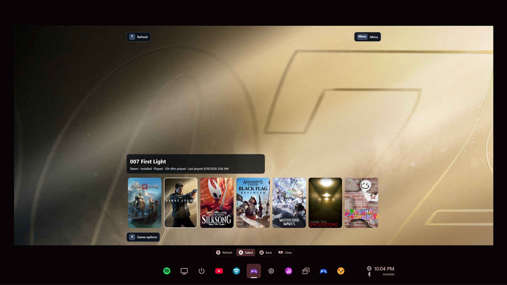
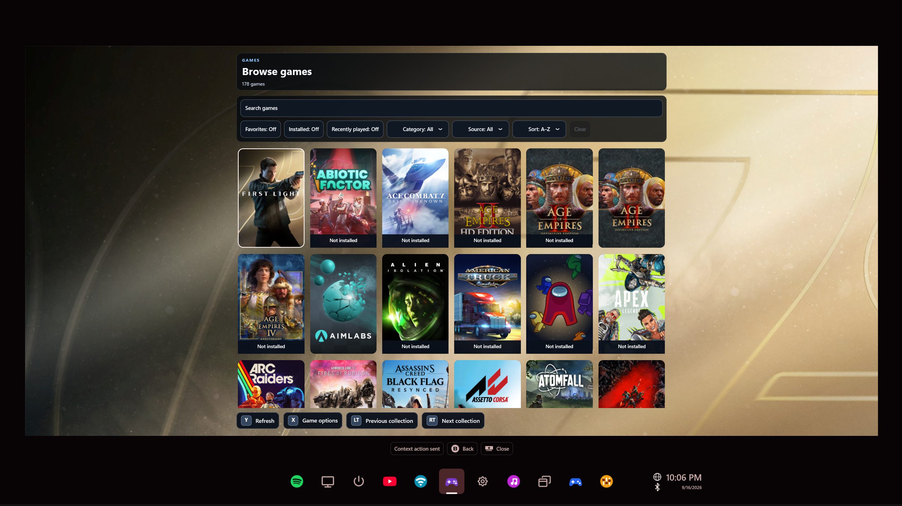

# Playnite Library

Bring your Playnite library into WidgetRail. Browse game artwork, find something
to play, and launch it with your controller without leaving the overlay.



## What you can do

- Browse installed games on Home, or search your wider library in Browse.
- Filter by favorites, installed status, source, and collections.
- Launch installed games through Playnite Bridge.
- Organize favorites, hidden games, categories, and completion status.

## Connect your library

This widget connects to **Playnite Bridge**, a separate local service. Installing
the widget does not install Playnite or configure the bridge for you.

1. Install Playnite Library's `.wrwidget` from [WidgetRail releases](https://github.com/sandwi-dev/WidgetRail/releases) through **Settings → Widgets**. Review the full-trust prompt and enable it.
2. Install and enable Playnite Bridge in Playnite, and keep Playnite running.
3. Copy the token from Playnite Bridge settings.
4. In WidgetRail, select **Set up connection**, paste the token, and save it.
5. Confirm the connection, then select **Back** to load your library.

The supported bridge listens on `localhost:19821` and must provide the compatible
games API. Tokens are stored privately in Windows Credential Manager.
You can reopen connection settings through **Menu → Playnite connection**.

## Use it with a controller

| Control | Action |
| --- | --- |
| A | Open a control or launch the selected installed game |
| X | Open options for the selected game |
| Y | Refresh Home or Browse |
| Menu | Open Library (Browse), Categories, Hidden games, or Playnite connection |
| B | Return from a nested page |

Home shows installed games. Open **Menu → Library** for Browse, which includes uninstalled games too; its **Installed**
filter narrows the list. Install those games through Playnite, then refresh the widget.



## Common questions

**The widget asks me to set up the bridge.** No token has been saved yet. Select
**Set up connection** to enter the token from Playnite Bridge settings.

**The saved token was rejected.** Select **Update token** and enter the current
token from Playnite Bridge settings.

**The bridge is unavailable.** Start Playnite and its bridge, then open
**Playnite connection → Test connection**. An incompatible bridge API needs a compatible bridge version.

**A game is missing.** Home only shows installed games. Check Browse, clear its
filters, and refresh after changing your library in Playnite.

**Does closing the overlay close Playnite?** No. The widget unloads after five
minutes hidden to release memory; Playnite and its bridge keep running.

## Build or customize

From the repository root:

```powershell
pwsh -NoProfile -File .\samples\PlayniteLibraryWidget\Build-CommunityPackage.ps1 -Configuration Release
```

The package is written to `artifacts/community-addons/playnite-library/` without installing it.
See [development notes](DEVELOPMENT.md) for the bridge contract, state ownership, caching, and package structure.
