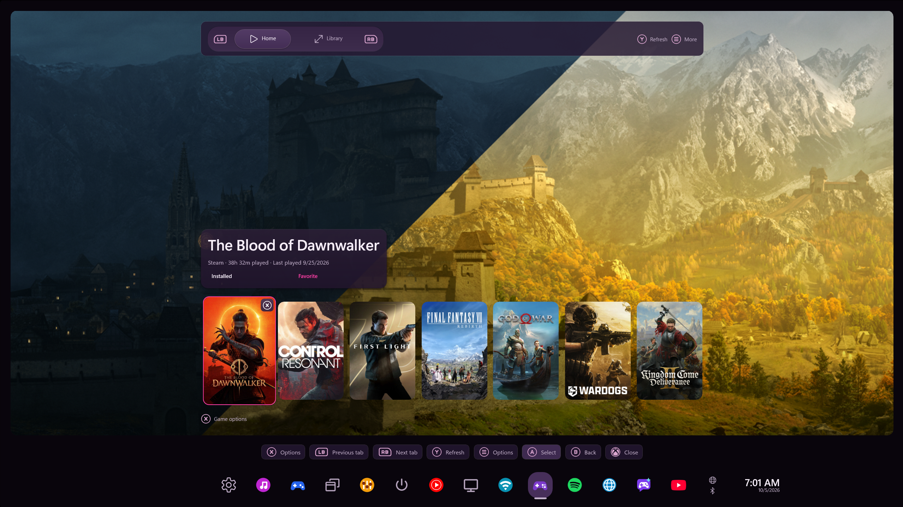
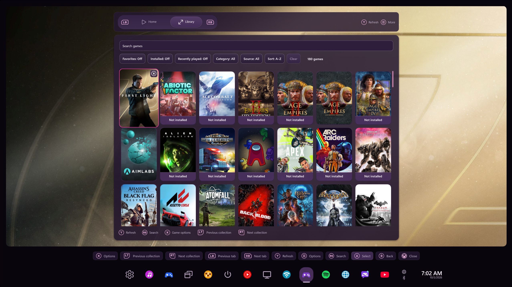

# Playnite Library

Bring your Playnite library into WidgetRail. Browse game artwork, find something
to play, and launch it with your controller without leaving the overlay.



## What you can do

- Browse installed games on Home, or search your wider library in Browse.
- Filter by favorites, installed status, source, and collections.
- Open game details over the current page, then launch installed games through Playnite Bridge.
- Organize favorites, hidden games, categories, and completion status.

## Connect your library

This widget connects to [**Playnite Bridge**](https://github.com/rollacode/playnite-bridge)
by [rollacode](https://github.com/rollacode), a Playnite plugin that provides a
local API. Install the plugin separately from the WidgetRail widget.

1. Install Playnite Library's `.wrwidget` from [WidgetRail releases](https://github.com/sandwi-dev/WidgetRail/releases) through **Settings → Widgets**. Review the full-trust prompt and enable it.
2. Download the `PlayniteBridge_vX.X.X.pext` plugin from [Playnite Bridge releases](https://github.com/rollacode/playnite-bridge/releases).
3. Drag the `.pext` file onto Playnite, follow its installation prompts, and restart Playnite. Keep Playnite running while using the widget.
4. In Playnite, open **Settings → Plugins → Playnite Bridge** and copy the API token.
5. In WidgetRail, select **Set up connection**, paste the token, and save it.
6. Confirm the connection, then select **Back** to load your library.

WidgetRail uses the plugin's local API. The optional Playnite Bridge sync backend
is not required.

The supported bridge listens on `localhost:19821` and must provide the compatible
games API. Tokens are stored privately in Windows Credential Manager.
You can reopen connection settings through **Menu → Playnite connection**.

## Use it with a controller

| Control | Action |
| --- | --- |
| A | Open game details; choose Play inside details to launch |
| RS click | Jump to Library search |
| Right stick movement | Scroll the focused list or panel |
| Y | Refresh Home or Browse |
| Menu | Open the focused game’s quick actions, or page options elsewhere |
| B | Close details or a nested page; from Home/Library, return to the tray |

Use the **Home** and **Library** navigation tabs to switch between peer destinations.
Each keeps its own game focus, filters, and scroll position. Home shows installed
games; Library includes uninstalled games too. Selecting either destination enters
its game list. Game details appears inside the widget with the page dimmed behind
it; B restores the selected game. Long details scroll inside the panel.

The **Installed** filter narrows Library. Install uninstalled games through Playnite,
then refresh the widget; the current Bridge API does not expose an installation
command or achievements. Pinned views keep showing the page without its modal.

The interface follows your selected WidgetRail theme. Categories open by selecting
the row; game covers retain their original artwork colors.



## Common questions

**The widget asks me to set up the bridge.** No token has been saved yet. Select
**Set up connection** to enter the token from Playnite Bridge settings.

**The saved token was rejected.** Select **Update token** and enter the current
token from Playnite Bridge settings.

**The bridge is unavailable.** Start Playnite and its bridge, then open
**Playnite connection → Test connection**. An incompatible bridge API needs a compatible bridge version.

**A game is missing.** Home only shows installed games. Check Browse, clear its
filters, and refresh after changing your library in Playnite.

**Does closing the overlay close Playnite?** No. The widget unloads after five
minutes hidden to release memory; Playnite and its bridge keep running.

## Build or customize

From the repository root:

```powershell
pwsh -NoProfile -File .\samples\PlayniteLibraryWidget\Build-CommunityPackage.ps1 -Configuration Release
```

The package is written to `artifacts/community-addons/playnite-library/` without installing it.
See [development notes](DEVELOPMENT.md) for the bridge contract, state ownership, caching, and package structure.
