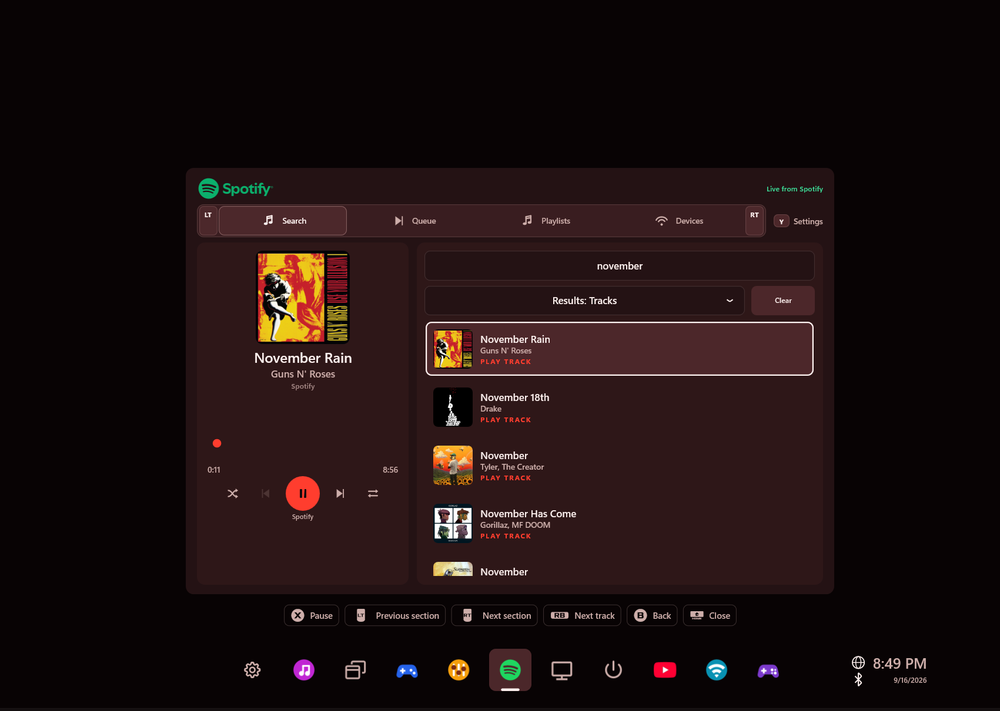
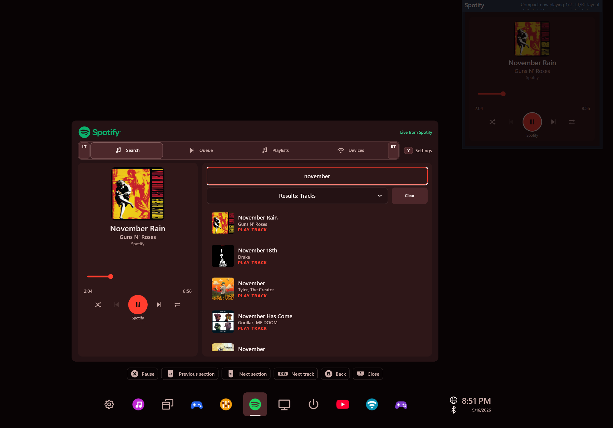

# Spotify

Find your next track and control your music from the overlay. Browse playlists,
manage playback on a Spotify device, or use **Play here** to listen through WidgetRail.



## What you can do

- Search for tracks, albums, artists, and playlists.
- Browse playlists and choose a track to start from.
- View the queue and add individual tracks to it.
- Switch playback devices or play locally through **This overlay**.
- Pin **Compact now playing** or **Now playing + up next** beside your game.

## Connect Spotify

You need a Spotify account and your own Spotify developer app. Spotify Premium is
required for Web Playback SDK streaming and Spotify's playback-control APIs.

1. Install the Spotify `.wrwidget` from [WidgetRail releases](https://github.com/sandwi-dev/WidgetRail/releases) through **Settings → Widgets**. Review the full-trust prompt and enable it.
2. Open **Setup** in the widget and create an app in the [Spotify Developer Dashboard](https://developer.spotify.com/dashboard).
3. Register this exact redirect URI in that app:

   ```text
   http://127.0.0.1:43827/callback/
   ```

4. Enter the app's **Client ID** in the widget. You do not need a Client Secret.
5. Select **Connect** and finish authorization in your browser.

Spotify's developer-mode restrictions still apply to your app and account. You can
return to the widget's Settings to replace the Client ID later.

## Use it with a controller

Use **LT / RT** to switch between Search, Queue, Playlists, and Devices. **A** activates
the focused control, **Y** opens Settings, and **B** returns from nested pages.
The on-screen guide shows playback and track-menu actions where available.

For local playback, open **Devices**, find **This overlay**, and select **Play here**.
The current WidgetRail installer includes the runtime needed by the local player.



## Common questions

**Play here does not start.** Update WidgetRail as well as the Spotify widget.
Older WidgetRail installers did not include the Windows Desktop runtime the player needs.

**Spotify rejects authorization.** Check the Client ID, the exact redirect URI,
and whether your Spotify app allows the account you're signing in with.

**Why can't I add a whole playlist to the queue?** Add to queue is limited to
individual tracks. Adding an entire collection would require a separate request per track.

**Does switching pages repeatedly call Spotify?** Search results and loaded collections
are retained while the widget runs. Playlist pages also use a bounded disk cache and
Spotify's `snapshot_id` to check whether cached content is still current.

## Build or customize

From the repository root:

```powershell
pwsh -NoProfile -File .\samples\SpotifyWidget\Build-CommunityPackage.ps1 -Configuration Release
```

The package is written to `artifacts/community-addons/spotify/` without installing it.
See [development notes](DEVELOPMENT.md) for authorization, local playback, caching, and lifecycle details.
