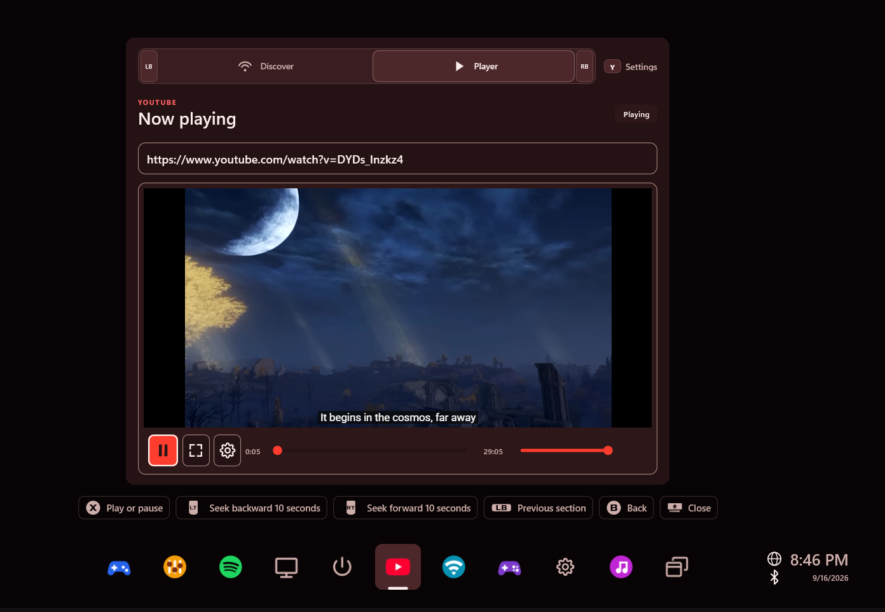
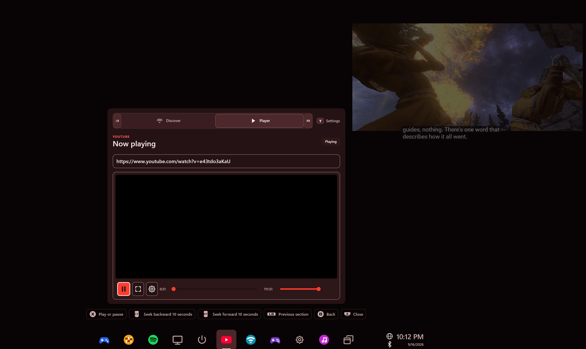

# YouTube Video

Watch a video without leaving your game. Search public YouTube videos, play a link,
or pin the video beside your game with controller controls still available.



## What you can do

- Search public videos in **Discover**, then switch to **Player** without losing your results.
- Paste a video link and start playback when you're ready.
- Pin the video or open fullscreen playback.
- Seek, adjust volume, mute, loop, and change playback speed.

## Get started

1. Install the YouTube Video `.wrwidget` from [WidgetRail releases](https://github.com/sandwi-dev/WidgetRail/releases) through **Settings → Widgets**.
2. Review the full-trust application prompt and enable the widget.
3. Choose **Play a link** on the setup screen, or open **Player**, to play a public video link. Configure search below when you're ready.

### Enable search

Search requires your own Google API key. Playing a link does not require a search key.

1. Open [Google Cloud Console](https://console.cloud.google.com/) and create or select a project.
2. Enable **YouTube Data API v3** and create an API key. Restrict it to that API.
3. Open the widget's **Settings** with Y, then test and save the key.

The key stays in Windows Credential Manager. Searches run when you submit a query;
additional pages load as you reach the end of the results. Google applies its API quota.

## Controller controls

| Control | Action |
| --- | --- |
| LB / RB | Switch between Discover and Player |
| A | Activate the focused control |
| Y | Open search Settings |
| LT / RT | Seek backward or forward by 10 seconds while playing |
| B | Return from Settings or exit fullscreen |

In pinned-video focus and fullscreen, **X** toggles play/pause. Follow the on-screen
guide for the actions available on the current page.

> **Screenshot space — pinned video:** add `screenshots/pinned-video.png` showing the video beside a game.
<!-- Replace this placeholder with:  -->

## Common questions

**Why won't a video play?** Private, removed, and embedding-disabled videos cannot
play here. Try another public video or open it on YouTube.

**Why doesn't playback start immediately?** Link entry cues the video. Select **Play** to start it.

**Can I choose quality or captions?** Quality is controlled by YouTube. For caption
choices that cannot be changed in the widget, use **Open in YouTube**.

## Build or customize

From the repository root:

```powershell
pwsh -NoProfile -File .\samples\YouTubeWidget\Build-CommunityPackage.ps1 -Configuration Release
```

The package is written to `artifacts/community-addons/youtube-video/` without installing it.
See [development notes](DEVELOPMENT.md) for the player architecture, security boundaries, and packaging details.
